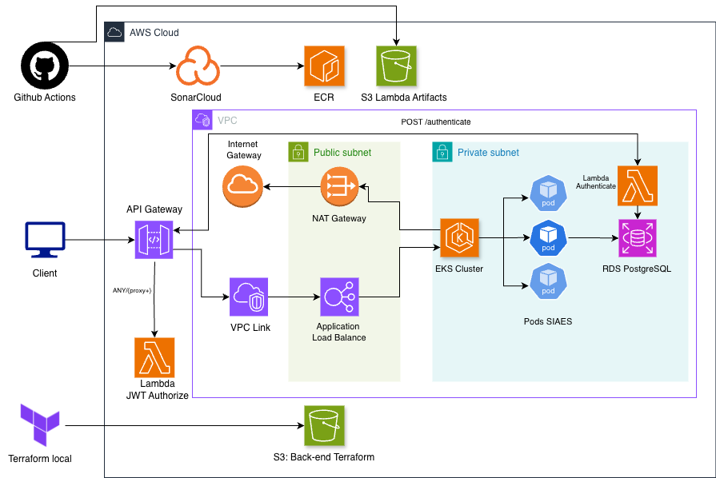
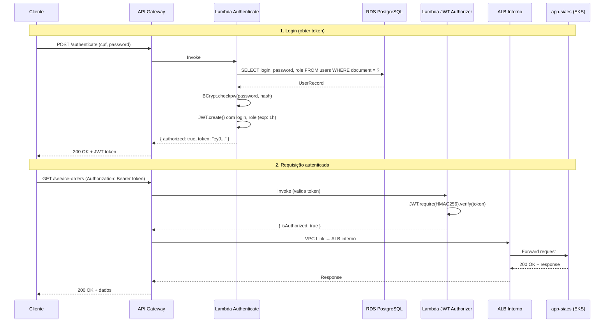
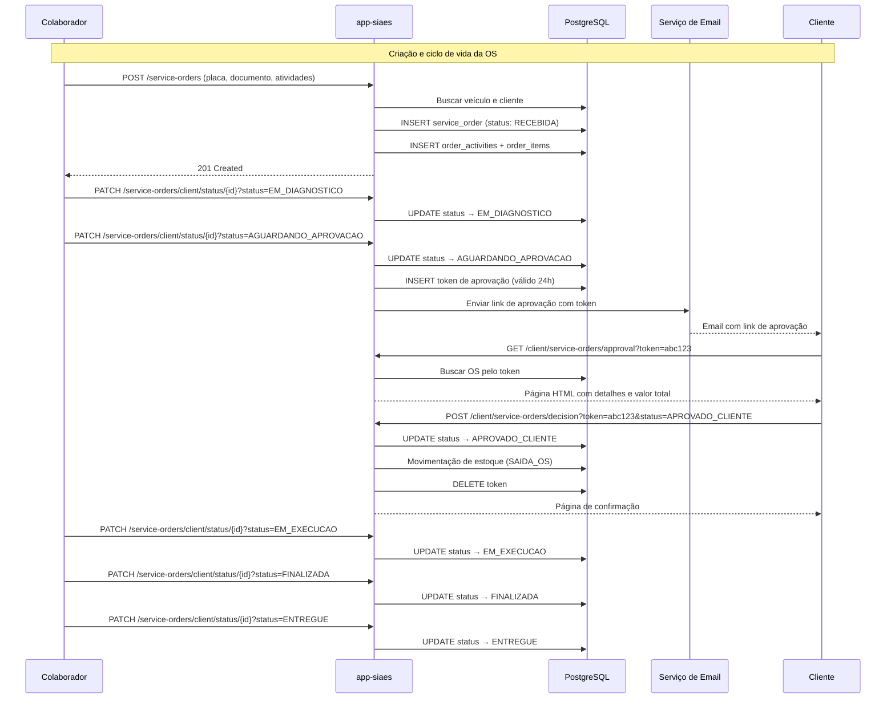
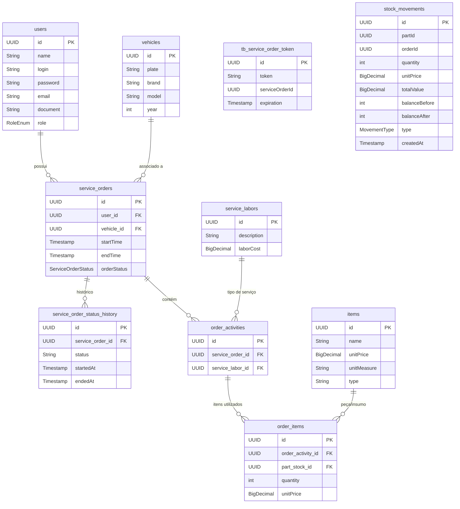

# NullPointerXp

**Pós-Graduação em Arquitetura de Software** | FIAP — SOAT Turma 13

## Sobre o Projeto

O **SIAES** (Sistema Integrado de Atendimento e Execução de Serviços) é uma plataforma para gerenciamento de ordens de serviço, desde o diagnóstico até a finalização, com autenticação via JWT, monitoramento com Datadog e deploy automatizado em AWS.

## Arquitetura



## Repositórios

| Repositório | Descrição | Stack |
|---|---|---|
| [`infra-app`](https://github.com/NullPointerXp/infra-app) | Infraestrutura base — VPC, EKS, ECR, ALB Controller | Terraform, AWS |
| [`infra-db`](https://github.com/NullPointerXp/infra-db) | Banco de dados — RDS PostgreSQL | Terraform, AWS |
| [`app-siaes`](https://github.com/NullPointerXp/app-siaes) | Aplicação principal — API REST de ordens de serviço | Java 21, Spring Boot, K8s |
| [`lambda-auth`](https://github.com/NullPointerXp/lambda-auth) | Autenticação — JWT Authorizer + API Gateway | Java 17, AWS Lambda, Terraform |

## Tech Stack

| Camada | Tecnologias |
|---|---|
| **Aplicação** | Java 21, Spring Boot 3.5, Spring Security, JPA/Hibernate |
| **Autenticação** | AWS Lambda (Java 17), JWT (HMAC256), API Gateway HTTP API |
| **Banco de Dados** | PostgreSQL 15 (RDS) |
| **Infraestrutura** | Terraform, AWS EKS, VPC, ECR, ALB, NAT Gateway |
| **Containers** | Docker, Kubernetes (EKS), HPA |
| **CI/CD** | GitHub Actions (build, test, deploy automático) |
| **Qualidade** | SonarCloud, JaCoCo, OWASP Dependency Check |
| **Observabilidade** | Datadog (APM, Logs, Infra), Spring Actuator, Logstash JSON |

## Ambientes

| Ambiente | Branch | Descrição |
|---|---|---|
| **Produção** | `main` | Ambiente principal com alta disponibilidade |
| **Staging** | `stg` | Ambiente de homologação com custos reduzidos |

## Ordem de Deploy (do zero)

```
1. infra-app    →  VPC, EKS, ECR, ALB Controller
2. infra-db     →  RDS PostgreSQL (depende da VPC)
3. app-siaes    →  Deploy da aplicação no EKS (cria o ALB via Ingress)
4. lambda-auth  →  Lambdas + API Gateway (depende do ALB)
```

Para destruir, a ordem é inversa: `lambda-auth → app-siaes → infra-db → infra-app`.

> Documentação detalhada de deploy e destroy disponível no [README do infra-app](https://github.com/NullPointerXp/infra-app).

---

## Diagramas de Sequência

### Fluxo de Autenticação



### Fluxo de Ordem de Serviço



---

## Modelo de Dados (Diagrama ER)



### Justificativa do Banco de Dados

**Por que PostgreSQL?**

- **Modelo relacional**: O domínio de ordens de serviço é inerentemente relacional — uma OS pertence a um cliente e a um veículo, contém atividades, que por sua vez contêm itens vinculados ao estoque. Essas relações 1:N e N:N com integridade referencial são o ponto forte de bancos relacionais.
- **ACID**: Operações críticas como movimentação de estoque (entrada/saída) e transições de status exigem transações atômicas. O PostgreSQL garante que uma saída de estoque + atualização de status ocorram de forma indivisível.
- **Herança de tabela**: O modelo usa single-table inheritance (`items` com discriminator `type`) para representar peças e insumos na mesma tabela. O PostgreSQL lida nativamente com esse padrão via JPA/Hibernate.
- **Compatibilidade com Spring Boot**: Driver nativo, Hibernate dialect maduro, e suporte completo a JSONB caso necessário para extensões futuras.
- **Custo**: RDS PostgreSQL `db.t3.micro` no Free Tier da AWS é gratuito por 12 meses. Mesmo fora do Free Tier, é uma das opções mais econômicas.

**Relacionamentos principais:**
- **users → service_orders**: Um cliente pode ter várias OS (1:N)
- **vehicles → service_orders**: Um veículo pode ter várias OS ao longo do tempo (1:N)
- **service_orders → order_activities**: Cada OS contém múltiplas atividades de serviço (1:N)
- **order_activities → order_items**: Cada atividade usa múltiplas peças/insumos (1:N)
- **service_orders → status_history**: Histórico completo de transições de status com timestamps (1:N)

---

## RFCs (Request for Comments)

### RFC-001: Escolha da Nuvem AWS

**Contexto:** Necessidade de hospedar a aplicação em nuvem pública com serviços gerenciados.

**Decisão:** AWS foi escolhida como provedor de nuvem.

**Justificativa:**
- Maior ecossistema de serviços gerenciados (EKS, RDS, Lambda, API Gateway)
- Free Tier generoso para ambiente acadêmico (RDS, Lambda, S3)
- Terraform possui módulos oficiais maduros para todos os serviços utilizados
- EKS permite usar Kubernetes padrão sem vendor lock-in no orquestrador
- Lambda + API Gateway oferecem autenticação serverless sem custo quando ocioso

**Alternativas consideradas:**
- **GCP (GKE)**: Kubernetes com boa experiência, mas menor Free Tier para RDS equivalente (Cloud SQL)
- **Azure (AKS)**: AKS é gratuito (só paga nodes), mas o ecossistema Terraform é menos maduro

---

### RFC-002: Estratégia de Autenticação

**Contexto:** A aplicação precisa autenticar usuários e proteger rotas da API com diferentes níveis de acesso (ADMIN, COLLABORATOR, CLIENT).

**Decisão:** Autenticação via JWT com Lambda Authorizer no API Gateway.

**Justificativa:**
- **Stateless**: JWT não requer sessão no servidor, compatível com auto-scaling do EKS (HPA)
- **Separação de responsabilidades**: A autenticação (Lambda) é independente da aplicação (EKS), permitindo evolução separada
- **API Gateway como gateway unificado**: Todas as requisições passam por um ponto único, facilitando rate limiting, logging e autenticação centralizada
- **Custo zero quando ocioso**: Lambda não cobra quando não há requisições, ideal para ambiente acadêmico
- **Aprovação sem login**: O fluxo de aprovação de OS pelo cliente usa tokens temporários (24h) acessíveis via link, sem exigir cadastro/login

**Fluxo:**
1. `POST /authenticate` → Lambda valida CPF + senha no RDS → retorna JWT (1h)
2. Demais rotas → Lambda JWT Authorizer valida o token → proxy para o ALB interno → app no EKS
3. Aprovação de OS → Token único enviado por email → páginas HTML públicas sem autenticação

**Alternativas consideradas:**
- **Cognito**: Mais completo (MFA, social login), mas overengineering para o escopo
- **Auth direto no Spring Security**: Mais simples, mas sem o benefício do gateway centralizado

---

### RFC-003: Escolha do Banco de Dados

**Contexto:** Necessidade de persistir dados de usuários, veículos, ordens de serviço, estoque e histórico.

**Decisão:** PostgreSQL 15 via AWS RDS.

**Justificativa:**
- Modelo de dados relacional com integridade referencial obrigatória (FK entre OS → cliente, veículo, atividades, itens)
- Transações ACID para operações críticas (movimentação de estoque + mudança de status)
- Hibernate/JPA oferecem suporte de primeiro nível ao PostgreSQL
- RDS elimina gerenciamento de backup, patching e replicação
- `db.t3.micro` é elegível ao Free Tier da AWS

**Alternativas consideradas:**
- **MySQL (RDS)**: Viável, mas PostgreSQL tem melhor suporte a tipos complexos e herança de tabela (single-table inheritance usado no modelo de `items`)
- **DynamoDB**: Inadequado — o modelo possui relações N:N (atividades → itens) e queries complexas (filtrar OS por status, veículo, cliente) que demandam JOINs
- **MongoDB**: Possível para o modelo de OS como documento, mas perderia integridade referencial no estoque

---

## ADRs (Architecture Decision Records)

### ADR-001: Kubernetes (EKS) como Orquestrador

**Status:** Aceito

**Contexto:** A aplicação precisa de deploy automatizado, auto-scaling e self-healing.

**Decisão:** Usar AWS EKS com managed node groups.

**Consequências:**
- (+) HPA escala automaticamente de 1 a 3 réplicas baseado em CPU (60%) e memória (70%)
- (+) Probes (startup, readiness, liveness) garantem self-healing
- (+) Rolling updates com zero downtime via Deployment strategy
- (+) AWS Load Balancer Controller cria ALBs automaticamente a partir de Ingress
- (-) EKS tem custo fixo de ~$73/mês pelo control plane
- (-) Curva de aprendizado maior que ECS/Fargate

---

### ADR-002: HPA (Horizontal Pod Autoscaler)

**Status:** Aceito

**Contexto:** A carga de trabalho varia — picos em horários comerciais, ocioso à noite.

**Decisão:** HPA com min 1, max 3 réplicas, baseado em CPU e memória.

**Configuração:**
- CPU target: 60% de utilização média
- Memory target: 70% de utilização média
- Scale up: até 100% de aumento, estabilização de 30s
- Scale down: até 50% de redução, estabilização de 30s

**Consequências:**
- (+) Custo otimizado — 1 réplica em baixa carga, até 3 em pico
- (+) Resposta automática a aumentos de demanda
- (-) Java (Spring Boot) tem cold start de ~60s, coberto pelo startupProbe (5 min timeout)

---

### ADR-003: API Gateway como Ponto de Entrada Único

**Status:** Aceito

**Contexto:** A aplicação precisa de autenticação centralizada, rate limiting futuro e roteamento entre Lambda (autenticação) e EKS (aplicação).

**Decisão:** AWS API Gateway HTTP API com VPC Link para o ALB interno.

**Consequências:**
- (+) Rota `/authenticate` vai para Lambda (serverless, sem custo ocioso)
- (+) Rota `ANY /{proxy+}` vai para o ALB do EKS com JWT Authorizer (cache de 5 min)
- (+) ALB interno (scheme: internal) não é exposto à internet — só acessível via VPC Link
- (+) Ponto único para logging, métricas e futuros middlewares
- (-) Adiciona ~10-30ms de latência por hop (API Gateway → VPC Link → ALB → Pod)

---

### ADR-004: Infraestrutura como Código com Terraform

**Status:** Aceito

**Contexto:** Necessidade de reprodutibilidade, versionamento e automação da infraestrutura.

**Decisão:** Terraform com módulos reutilizáveis e state remoto no S3.

**Consequências:**
- (+) Ambientes prod e stg criados a partir dos mesmos módulos com valores diferentes
- (+) State no S3 permite colaboração e uso tanto local quanto via GitHub Actions
- (+) Destroy e recreate confiável — o state sabe exatamente o que foi criado
- (+) Remote state entre projetos (infra-db lê outputs do infra-app)
- (-) Requer conhecimento de HCL e da API da AWS

---

### ADR-005: Separação em 4 Repositórios

**Status:** Aceito

**Contexto:** O projeto envolve infraestrutura de rede, banco de dados, aplicação e autenticação — com ciclos de vida diferentes.

**Decisão:** Dividir em 4 repositórios independentes com remote state entre eles.

| Repositório | Ciclo de vida | Motivo da separação |
|---|---|---|
| `infra-app` | Raramente muda | VPC e EKS são estáveis após criação |
| `infra-db` | Raramente muda | RDS é estável, schema evolui via JPA |
| `app-siaes` | Muda frequentemente | Código da aplicação com deploy contínuo |
| `lambda-auth` | Muda ocasionalmente | Autenticação é independente do app |

**Consequências:**
- (+) Deploy independente — mudar o app não reaplica a infra
- (+) Permissões granulares — time de infra vs time de app
- (+) CI/CD mais rápido — cada repo builda apenas o que é seu
- (-) Dependência entre repos via remote state (ordem de deploy importa)

---

## Integrantes

| Nome | GitHub                                                               |
|---|----------------------------------------------------------------------|
| Douglas Andrade Severa | [@Douglas-Andrade-Severa](https://github.com/Douglas-Andrade-Severa) |
| Edmar Santos | [@edmarsantos](https://github.com/edmarsantos)                       |
| Felipe Martines Kurjata | [@Kurjata](https://github.com/Kurjata)                               |
| Maximiliano Andrade | [maximilianoandrade67-hash](https://github.com/maximilianoandrade67-hash)                                                                |
| Vinícius Louzada | [@vinelouzada](https://github.com/vinelouzada)                       |
