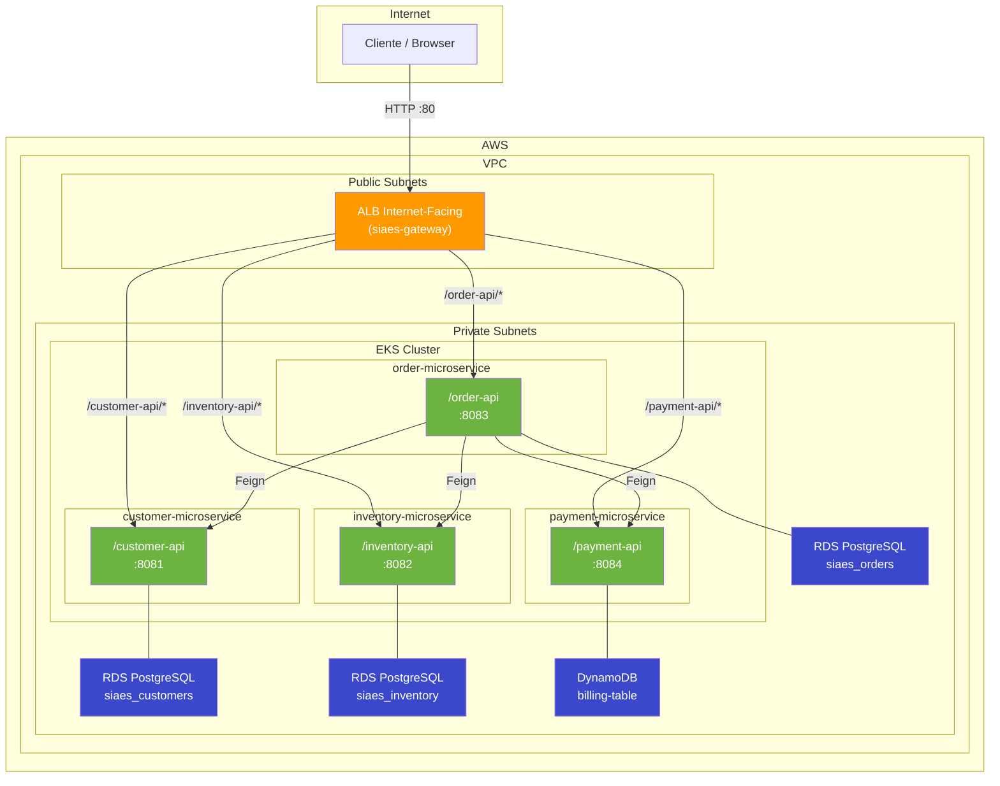
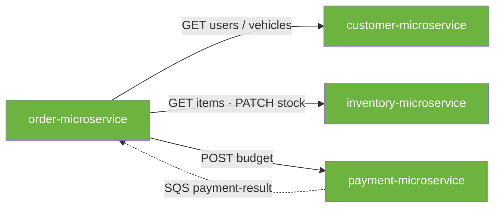
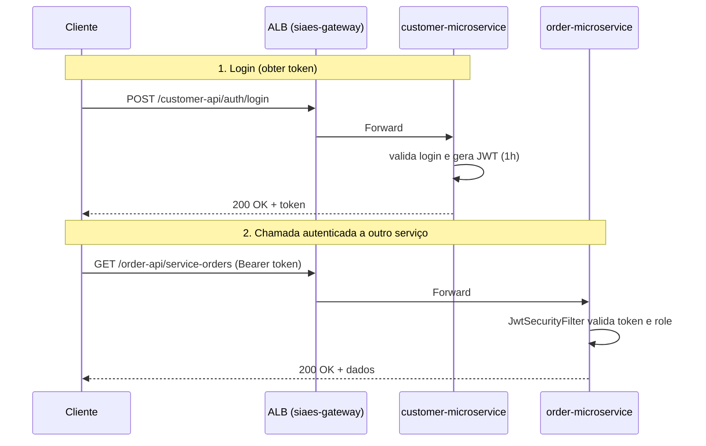
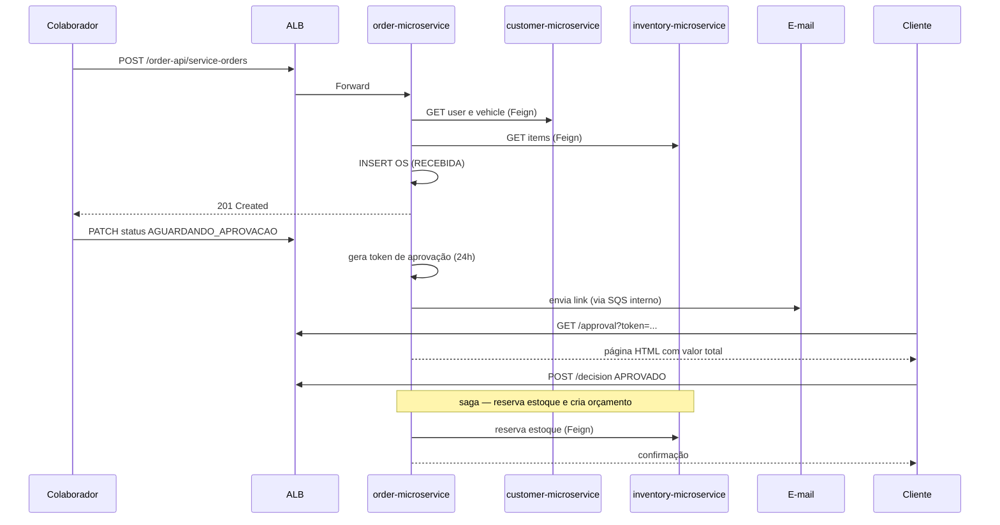
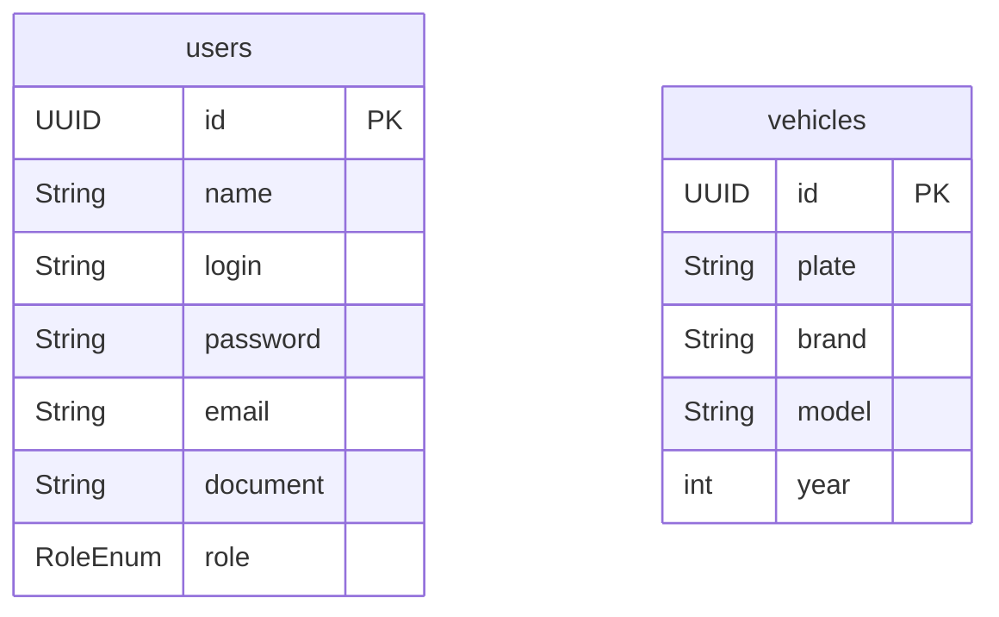
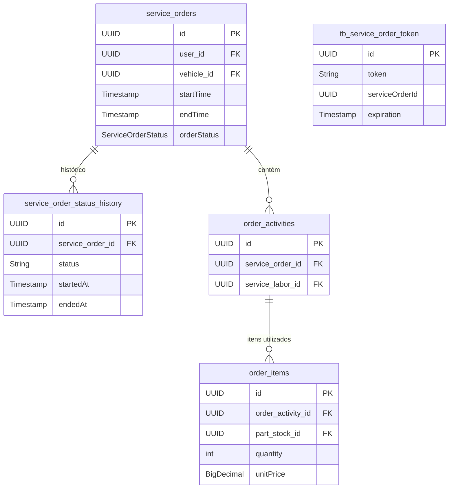
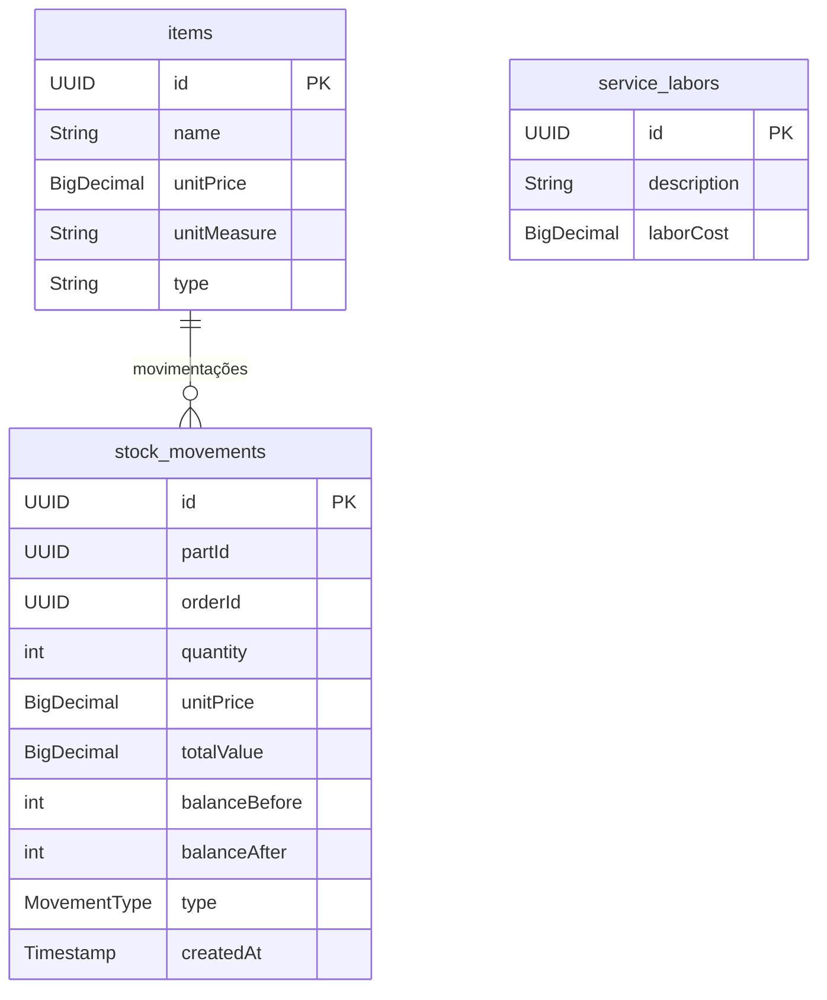

# NullPointerXp

**Pós-Graduação em Arquitetura de Software** | FIAP — SOAT Turma 13

## Sobre o Projeto

O **SIAES** (Sistema Integrado de Atendimento e Execução de Serviços) é uma plataforma para gerenciamento de ordens de serviço, desde o diagnóstico até a finalização, com autenticação via JWT, monitoramento com Datadog e deploy automatizado em AWS.

## Arquitetura

### Visão da Infraestrutura AWS

```
┌───────────────────────────────────────────────────────────────────────────────────────────────────────────┐
│  AWS Cloud                                                                                                │
│                                                                                                           │
│  ┌──────────────┐    ┌────────────┐    ┌──────────────────┐                                               │
│  │GitHub Actions│───>│ SonarCloud │───>│  ECR (4 repos)   │  ← 1 repo/imagem por MS/ambiente              │
│  └──────┬───────┘    └────────────┘    └──────────────────┘                                               │
│         │ build + push (CI de cada microsserviço)                          ┌─────────┐                    │
│         │ terraform apply                                                  │ Datadog │                    │
│         v                                                                  │ (prod)  │                    │
│  ┌──────────────┐                                                          └─────────┘                    │
│  │ S3 Terraform │   state: infra-app + state por microsserviço (pasta infra/)                             │
│  │   Backend    │                                                                                         │
│  └──────────────┘                                                                                         │
│                                                                                                           │
│  ┌──────────────────────────────────────────────────────────────────────────────────────────────────┐     │  
│  │  VPC  (provisionada pelo infra-app)                                                              │     │
│  │                                                                                                  │     │ 
│  │  ┌──────────────────────────────────────┐  ┌────────────────────────────────────────────────┐    │     │
│  │  │  Public Subnets                      │  │  Private Subnets                               │    │     │ 
│  │  │                                      │  │                                                │    │     │
│  │  │  ┌────────────────┐  ┌────────────┐  │  │  ┌────────────────────────────────────────┐    │    │     │
│  │  │  │ Internet       │  │ NAT        │  │  │  │  EKS Cluster                           │    │    │     │ 
│  │  │  │ Gateway        │  │ Gateway    │──│──│─>│                                        │    │    │     │
│  │  │  └───────┬────────┘  └────────────┘  │  │  │  ┌──────┐ ┌──────┐ ┌──────┐ ┌──────┐   │    │    │     │
│  │  │          │                           │  │  │  │cust. │ │order │ │inven.│ │paymt │   │    │    │     │
│  │  │  ┌───────v────────────────────────┐  │  │  │  │ pod  │ │ pod  │ │ pod  │ │ pod  │   │    │    │     │
│  │  │  │ ALB Internet-Facing            │  │  │  │  │:8081 │ │:8083 │ │:8082 │ │:8084 │   │    │    │     │
│  │  │  │ (siaes-gateway)                │──│──│─>│  └──┬───┘ └──┬───┘ └──┬───┘ └───┬──┘   │    │    │     │
│  │  │  │                                │  │  │  │     │        │        │         │      │    │    │     │
│  │  │  │  /customer-api/*  ─> :8081     │  │  │  └─────┼────────┼────────┼─────────┼──────┘    │    │     │
│  │  │  │  /order-api/*     ─> :8083     │  │  │        │        │        │         │           │    │     │
│  │  │  │  /payment-api/*   ─> :8084     │  │  │   ┌────v────┐ ┌─v────┐ ┌─v────┐ ┌──v───────┐   │    │     │
│  │  │  └────────────────────────────────┘  │  │   │  RDS    │ │ RDS  │ │ RDS  │ │ DynamoDB │   │    │     │
│  │  │                                      │  │   │customers│ │orders│ │inven.│ │ billing  │   │    │     │
│  │  └──────────────────────────────────────┘  │   └─────────┘ └──────┘ └──────┘ └──────────┘   │    │     │
│  │                                            │                                                │    │     │
│  │                                            │  ┌─────────────────────────────────────┐       │    │     │
│  │                                            │  │  Amazon SQS (Terraform por MS)      │       │    │     │
│  │                                            │  │  · awaiting-approval  (order)       │       │    │     │
│  │                                            │  │  · payment-result     (pay → order) │       │    │     │
│  │                                            │  └─────────────────────────────────────┘       │    │     │
│  │                                            └────────────────────────────────────────────────┘    │     │
│  └──────────────────────────────────────────────────────────────────────────────────────────────────┘     │
└───────────────────────────────────────────────────────────────────────────────────────────────────────────┘

         ^
         │  HTTP :80
    ┌────┴────┐
    │ Cliente │          Mercado Pago (webhook) ──HTTP──> ALB /payment-api/.../webhook/...
    └─────────┘
```

| Terraform | Repositório | Recursos principais |
|-----------|-------------|---------------------|
| Plataforma | `infra-app` | VPC, EKS, Load Balancer Controller, Datadog (prod) |
| Por serviço | `*-microservice` / `infra/environments/` | ECR, RDS ou DynamoDB, SQS (quando aplicável) |
| Módulos | `terraform-modules` | Blocos reutilizáveis (vpc, eks, rds, sqs, …) |

### Visão Detalhada dos Componentes


```mermaid
graph TB
    subgraph Internet
        Client[Cliente / Browser]
    end

    subgraph AWS
        subgraph VPC
            subgraph Public Subnets
                ALB["ALB Internet-Facing<br/>(siaes-gateway)"]
            end

            subgraph Private Subnets
                subgraph EKS Cluster
                    direction TB

                    subgraph customer-pod["customer-microservice"]
                        CS["/customer-api<br/>:8081"]
                    end

                    subgraph order-pod["order-microservice"]
                        OS["/order-api<br/>:8083"]
                    end

                    subgraph inventory-pod["inventory-microservice"]
                        IS["/inventory-api<br/>:8082"]
                    end

                    subgraph payment-pod["payment-microservice"]
                        PS["/payment-api<br/>:8084"]
                    end
                end

                RDS_C["RDS PostgreSQL<br/>siaes_customers"]
                RDS_O["RDS PostgreSQL<br/>siaes_orders"]
                RDS_I["RDS PostgreSQL<br/>siaes_inventory"]
                DDB["DynamoDB<br/>billing-table"]
            end
        end
    end

    Client -->|"HTTP :80"| ALB
    ALB -->|"/customer-api/*"| CS
    ALB -->|"/order-api/*"| OS
    ALB -->|"/inventory-api/*"| IS
    ALB -->|"/payment-api/*"| PS

    OS -->|"Feign"| CS
    OS -->|"Feign"| IS
    OS -->|"Feign"| PS

    CS --- RDS_C
    OS --- RDS_O
    IS --- RDS_I
    PS --- DDB

    style ALB fill:#FF9900,color:#fff
    style CS fill:#6DB33F,color:#fff
    style OS fill:#6DB33F,color:#fff
    style IS fill:#6DB33F,color:#fff
    style PS fill:#6DB33F,color:#fff
    style RDS_C fill:#3B48CC,color:#fff
    style RDS_O fill:#3B48CC,color:#fff
    style RDS_I fill:#3B48CC,color:#fff
    style DDB fill:#3B48CC,color:#fff
```

> **SQS** (não aparece no desenho acima para não poluir): fila de e-mail de aprovação no `order`; fila de resultado de pagamento do `payment` para o `order`. Ver [Saga Orchestrator](#saga-orchestrator-order-microservice).

### Visão do Fluxo de Requisição

Requisições **síncronas** (HTTP pelo ALB):

```
                                         ┌───────────────────────┐     ┌──────────────────────┐
                                    ┌───>│  customer-microservice│────>│  RDS siaes_customers │
                                    │    │  /customer-api  :8081 │     └──────────────────────┘
                                    │    └───────────────────────┘
                                    │              ^
┌─────────┐   ┌───────────────────┐ │              │ Feign + JWT
│ Cliente │──>│  ALB siaes-gateway│─┤              │
└─────────┘   │  (internet-facing)│ │    ┌───────────────────────┐     ┌──────────────────────┐
              └───────────────────┘ ├───>│  order-microservice   │────>│  RDS siaes_orders    │
                                    │    │  /order-api     :8083 │     └──────────────────────┘
                                    │    └───────────────────────┘
                                    │              │ Feign + JWT
                                    │              v
                                    │    ┌────────────────────────┐     ┌──────────────────────┐
                                    └───>│  inventory-microservice│ ───>│  RDS siaes_inventory │
                                         │  /inventory-api :8082  │     └──────────────────────┘
                                         └────────────────────────┘

              Mesmo ALB  ──────────>   payment-microservice /payment-api :8084  ──>  DynamoDB
                                       (webhook Mercado Pago também entra pelo ALB)
```

Requisições **assíncronas** (mensageria):

```
  order ──publica──> SQS awaiting-approval ──consome──> order (envia e-mail ao cliente)

  Mercado Pago ──webhook──> payment ──publica──> SQS payment-result ──consome──> order (atualiza OS)
```

### Mudanças da Fase 3 para Fase 4

| Aspecto | Fase 3 (Monolito) | Fase 4 (Microserviços) |
|---|---|---|
| **Aplicação** | Monolito `app-siaes` | 4 microserviços independentes |
| **Banco de Dados** | RDS compartilhado | 1 RDS por serviço relacional; `payment` usa DynamoDB (single-table) |
| **Autenticação** | Lambda Auth + API Gateway | Spring Security + JWT no ALB |
| **Exposição** | ALB interno + API Gateway + VPC Link | ALB internet-facing unificado (Ingress Group) |
| **Roteamento** | API Gateway com Lambda Authorizer | Ingress Kubernetes por `context_path` |
| **Comunicação interna** | N/A (monolito) | OpenFeign (+ JWT) e SQS para eventos de domínio |
| **Transações distribuídas** | Transação local única | **Saga orchestrator** no `order-microservice` (compensações explícitas) |
| **IaC** | Stack monolítica | `infra-app` (plataforma) + `infra/` por microsserviço + `terraform-modules` |

## Repositórios

| Repositório | Descrição | Stack |
|---|---|---|
| [`infra-app`](https://github.com/NullPointerXp/infra-app) | Plataforma compartilhada — VPC, EKS, Load Balancer Controller, Datadog (prod) | Terraform, AWS, Helm |
| [`customer-microservice`](https://github.com/NullPointerXp/customer-microservice) | Usuários, veículos, autenticação JWT | Java 21, Spring Boot, K8s |
| [`order-microservice`](https://github.com/NullPointerXp/order-microservice) | OS, atividades, **saga orchestrator**, integração inventory/payment | Java 21, Spring Boot, SQS, K8s |
| [`inventory-microservice`](https://github.com/NullPointerXp/inventory-microservice) | Estoque, peças, mão de obra, reserva/confirmação | Java 21, Spring Boot, K8s |
| [`payment-microservice`](https://github.com/NullPointerXp/payment-microservice) | Orçamentos, Mercado Pago, webhook, publicação em SQS | Java 21, Spring Boot, DynamoDB, K8s |
| [`k8s`](https://github.com/NullPointerXp/k8s) | Templates K8s (Deployment, Service, Ingress, ConfigMap, HPA, Secrets) | Kubernetes YAML |
| [`github-action`](https://github.com/NullPointerXp/github-action) | Workflows reutilizáveis (Terraform + build Maven + deploy EKS) | GitHub Actions |
| [`terraform-modules`](https://github.com/NullPointerXp/terraform-modules) | Módulos compartilhados (VPC, EKS, ECR, RDS, DynamoDB, SQS, …) | Terraform |

> **Legado / descontinuados na Fase 4:** [`app-siaes`](https://github.com/NullPointerXp/app-siaes) (monolito), [`lambda-auth`](https://github.com/NullPointerXp/lambda-auth) (Lambda + API Gateway), [`infra-db`](https://github.com/NullPointerXp/infra-db) (RDS centralizado — substituído pelo Terraform em cada microsserviço).

## Tech Stack

| Camada | Tecnologias |
|---|---|
| **Aplicação** | Java 21, Spring Boot 3.5, Spring Security, JPA/Hibernate, OpenFeign |
| **Autenticação** | JWT (HMAC256) via Spring Security em cada microserviço |
| **Banco de Dados** | PostgreSQL 15 (RDS) — 1 instância por microserviço relacional; DynamoDB para pagamentos |
| **Infraestrutura** | Terraform, AWS EKS, VPC, ECR (por MS), ALB, RDS, DynamoDB, SQS, NAT Gateway |
| **Integração assíncrona** | Amazon SQS (Spring Cloud AWS) — aprovação de OS e resultado de pagamento |
| **Pagamentos** | Mercado Pago (Orders API + webhook) |
| **Containers** | Docker, Kubernetes (EKS), HPA |
| **CI/CD** | GitHub Actions — workflows reutilizáveis (build, test, Terraform, deploy) |
| **Qualidade** | SonarCloud, JaCoCo, OWASP Dependency Check |
| **Observabilidade** | Datadog (APM, Logs, Infra), Spring Actuator, Logstash JSON |

## Ambientes

| Ambiente | Branch | Descrição |
|---|---|---|
| **Produção** | `main` | Ambiente principal com alta disponibilidade |
| **Staging** | `stg` | Ambiente de homologação com custos reduzidos |

## Ordem de Deploy (do zero)

```
1. infra-app              →  VPC, EKS, Load Balancer Controller (+ Datadog Operator em prod)
2. customer-microservice  →  Terraform (ECR + RDS) + deploy EKS
3. inventory-microservice →  Terraform (ECR + RDS) + deploy EKS   # antes do order (Feign na criação de OS)
4. order-microservice     →  Terraform (ECR + RDS + SQS awaiting-approval) + deploy EKS
5. payment-microservice   →  Terraform (ECR + DynamoDB + SQS payment-result) + deploy EKS
```

Cada microsserviço lê o **remote state** do `infra-app` (VPC, subnets, security group dos nodes). O ALB `siaes-gateway` nasce no primeiro Ingress aplicado.

**Destroy (inverso):** `payment → order → inventory → customer → infra-app`.

**CI/CD:** workflows em cada repo chamam [`github-action`](https://github.com/NullPointerXp/github-action) (`reusable-terraform-microservice.yml` + `reusable-java-eks-deploy.yml`), pin **`@v1.0.10`**. Módulos Terraform compartilhados: **`terraform-modules@v1.2.0`**.

**Secrets GitHub (Mercado Pago):** `MP_ACCESS_TOKEN` / `MP_WEBHOOK_SECRET` (prod) e `MP_ACCESS_TOKEN_STG` / `MP_WEBHOOK_SECRET_STG` (stg).

> Detalhes operacionais: [README do infra-app](https://github.com/NullPointerXp/infra-app).

---

## Microserviços

### customer-microservice (`/customer-api`)

Responsável pela gestão de usuários, veículos e autenticação.

| Recurso | Endpoints principais |
|---|---|
| **Auth** | `POST /auth/login` |
| **Users** | `GET/POST/PUT/DELETE /users` |
| **Vehicles** | `GET/POST/PUT/DELETE /vehicles` |

**Terraform:** ECR + RDS PostgreSQL (`infra/environments/`).

### order-microservice (`/order-api`)

Responsável pelas ordens de serviço, atividades, fluxo de aprovação e **orquestração da saga** entre inventory e payment.

| Recurso | Endpoints principais |
|---|---|
| **Service Orders** | `GET/POST /service-orders`, `PATCH /status` |
| **Aprovação** | `GET /client/service-orders/approval?token=...`, `POST .../decision` |
| **Activities** | `GET/POST /order-activities` |
| **Items** | `GET/POST /order-items` |

**Terraform (`infra/environments/`):** ECR, RDS PostgreSQL, fila SQS `service-order-awaiting-approval-{env}` (e-mail assíncrono de aprovação).

### Saga Orchestrator (order-microservice)

O `order-microservice` adota o padrão **Saga Orchestrator** (orquestração centralizada): um coordenador no domínio de OS define a ordem dos passos, chama os participantes e executa **compensações** quando um passo falha. Não usamos coreografia pura (cada serviço reagindo sozinho a eventos sem dono do fluxo).

**Coordenador:** `ClientApprovalOrchestrationUseCase` — reutilizado pelo fluxo autenticado (`UpdateStatusServiceOrderUseCase`), pelo link de token (`ApproveOrRejectByTokenUseCase`) e pelas operações de estoque em `ProcessPaymentResultUseCase`.

**Participantes e integração:**

| Participante | Integração | Papel na saga |
|---|---|---|
| `inventory-microservice` | OpenFeign (`PATCH .../stock/operation`) | Reserva, cancelamento e confirmação de estoque |
| `payment-microservice` | OpenFeign (`POST .../budget`) | Criação do orçamento após aprovação |
| `payment-microservice` | SQS `payment-result-{env}` | Resultado assíncrono do webhook Mercado Pago → `ProcessPaymentResultUseCase` |

**Passos da saga de aprovação do cliente** (`executeApproval`):

1. Carregar itens da OS e dados do cliente (Feign customer).
2. **Reservar estoque** em todos os itens (inventory).
3. **Criar orçamento** no payment (Feign).
4. Persistir status `APROVADO_CLIENTE` → `AGUARDANDO_PAGAMENTO`.

**Compensações implementadas:**

- Falha ao criar orçamento → `CANCEL_RESERVATION` no inventory antes de retornar erro ao cliente.
- Falha em item durante reserva parcial → compensa itens já reservados no mesmo loop (`applyStockOperation`).
- Pagamento reprovado (mensagem SQS) → `CANCEL_RESERVATION` e status `PAGAMENTO_REPROVADO`.

**Por que orchestrator (e não choreography)?**

| Motivo | Explicação |
|---|---|
| **Dono do processo** | O ciclo de vida da OS pertence ao domínio *order*; a sequência “reservar → cobrar → aguardar pagamento” é regra de negócio da OS, não do payment ou do inventory isoladamente. |
| **Ordem explícita** | É obrigatório reservar estoque **antes** de abrir o orçamento, para não cobrar sem garantir peças. Na coreografia, essa ordem dependeria de convenções frágeis entre eventos. |
| **Compensação visível** | Rollback de reserva em um único lugar (`ClientApprovalOrchestrationUseCase`) facilita testes, logs e suporte; evita “compensações espalhadas” em vários consumidores SQS. |
| **Reuso de fluxos** | O mesmo orquestrador atende aprovação por JWT (colaborador) e por token público (cliente), sem duplicar lógica distribuída. |
| **Sem 2PC** | Database-per-service impede transação global; saga com compensação é o padrão aceito para consistência **eventual** entre bounded contexts. |
| **Assíncrono só onde importa** | O webhook do Mercado Pago é lento e externo; o payment publica em SQS e o order reage — o orquestrador síncrono cobre o trecho crítico (aprovação + reserva + orçamento). |

```
  Cliente aprova a OS (link com token ou colaborador via API)
                    │
                    ▼
         ┌─────────────────────────────┐
         │     order-microservice       │  ← saga orchestrator
         │ ClientApprovalOrchestration  │
         └──────────────┬──────────────┘
                    │
     ┌──────────────┼──────────────┐
     │ 1            │ 2            │ 3
     ▼              ▼              ▼
 inventory      payment         RDS order
 RESERVE_STOCK   POST /budget    status →
 (Feign)         (Feign)         AGUARDANDO_PAGAMENTO

     Se (2) falhar ──compensação──> CANCEL_RESERVATION no inventory

  ─ ─ ─ ─ ─ ─ ─ ─ ─ ─ ─ ─ ─ ─ ─ ─ ─ ─ ─ ─ ─ ─ ─ ─ ─ ─ ─ ─ ─ ─

  Depois (assíncrono):

  Mercado Pago ──webhook──> payment ──SQS payment-result──> order
                                                                  │
                                    PAGAMENTO_REPROVADO ──────────┴──> cancela reserva
                                    PAGAMENTO_APROVADO  ──────────────> atualiza status
```

### inventory-microservice (`/inventory-api`)

Responsável pelo estoque, peças, serviços e movimentações (inclui operações de reserva usadas pela saga do order).

| Recurso | Endpoints principais |
|---|---|
| **Items (Parts)** | `GET/POST/PUT/DELETE /parts` |
| **Service Labor** | `GET/POST/PUT/DELETE /service-labor` |
| **Stock** | `PATCH /parts/{id}/stock/operation` |

**Terraform:** ECR + RDS PostgreSQL.

### payment-microservice (`/payment-api`)

Orçamentos e pagamentos com integração Mercado Pago; persistência em **DynamoDB** (tabela single-table com GSI).

| Recurso | Endpoints principais |
|---|---|
| **Budgets** | Base `/payment-service/budget` (com `context_path` `/payment-api`: `/payment-api/payment-service/budget/...`) |
| **Payments** | Base `/payment-service/payment` |
| **Webhook Mercado Pago** | `POST /payment-service/webhook/mercado-pago` — URL pública do MP no ALB; secrets `MP_*` no GitHub |

**Terraform:** ECR, DynamoDB (`billing-table-{env}`, PK/SK + GSI1/GSI2), SQS `payment-result-{env}`; políticas IAM na role dos nodes EKS para acesso à tabela e à fila.

### Comunicação entre Microserviços


```mermaid
graph LR
    Order["order-microservice"]
    Customer["customer-microservice"]
    Inventory["inventory-microservice"]
    Payment["payment-microservice"]

    Order -->|"GET users / vehicles"| Customer
    Order -->|"GET items · PATCH stock"| Inventory
    Order -->|"POST budget"| Payment
    Payment -.->|"SQS payment-result"| Order

    style Order fill:#6DB33F,color:#fff
    style Customer fill:#6DB33F,color:#fff
    style Inventory fill:#6DB33F,color:#fff
    style Payment fill:#6DB33F,color:#fff
```

O `order-microservice` é o **orquestrador da saga** e concentra as chamadas Feign (JWT propagado pelo `FeignClientInterceptor`). O `payment` devolve o resultado do pagamento via **SQS**, sem o order precisar expor endpoint para o webhook do Mercado Pago.

---

## Diagramas de Sequência

### Fluxo de Autenticação


```mermaid
sequenceDiagram
    participant Client as Cliente
    participant ALB as ALB (siaes-gateway)
    participant Customer as customer-microservice
    participant Order as order-microservice

    Note over Client,Customer: 1. Login (obter token)
    Client->>ALB: POST /customer-api/auth/login
    ALB->>Customer: Forward
    Customer->>Customer: valida login e gera JWT (1h)
    Customer-->>Client: 200 OK + token

    Note over Client,Order: 2. Chamada autenticada a outro serviço
    Client->>ALB: GET /order-api/service-orders (Bearer token)
    ALB->>Order: Forward
    Order->>Order: JwtSecurityFilter valida token e role
    Order-->>Client: 200 OK + dados
```

### Fluxo de Ordem de Serviço


```mermaid
sequenceDiagram
    participant Colab as Colaborador
    participant ALB as ALB
    participant Order as order-microservice
    participant Customer as customer-microservice
    participant Inventory as inventory-microservice
    participant Email as E-mail
    participant Cliente as Cliente

    Colab->>ALB: POST /order-api/service-orders
    ALB->>Order: Forward
    Order->>Customer: GET user e vehicle (Feign)
    Order->>Inventory: GET items (Feign)
    Order->>Order: INSERT OS (RECEBIDA)
    Order-->>Colab: 201 Created

    Colab->>ALB: PATCH status AGUARDANDO_APROVACAO
    Order->>Order: gera token de aprovação (24h)
    Order->>Email: envia link (via SQS interno)

    Cliente->>ALB: GET /approval?token=...
    Order-->>Cliente: página HTML com valor total

    Cliente->>ALB: POST /decision APROVADO
    Note over Order,Inventory: saga — reserva estoque e cria orçamento
    Order->>Inventory: reserva estoque (Feign)
    Order-->>Cliente: confirmação
```

Pagamento pelo Mercado Pago e atualização final da OS são **assíncronos** (SQS) — ver [Saga Orchestrator](#saga-orchestrator-order-microservice).

---

## Modelo de Dados (Diagrama ER)

### customer-microservice (siaes_customers)


```mermaid
erDiagram
    users {
        UUID id PK
        String name
        String login
        String password
        String email
        String document
        RoleEnum role
    }

    vehicles {
        UUID id PK
        String plate
        String brand
        String model
        int year
    }
```

### order-microservice (siaes_orders)


```mermaid
erDiagram
    service_orders {
        UUID id PK
        UUID user_id FK
        UUID vehicle_id FK
        Timestamp startTime
        Timestamp endTime
        ServiceOrderStatus orderStatus
    }

    service_order_status_history {
        UUID id PK
        UUID service_order_id FK
        String status
        Timestamp startedAt
        Timestamp endedAt
    }

    tb_service_order_token {
        UUID id PK
        String token
        UUID serviceOrderId
        Timestamp expiration
    }

    order_activities {
        UUID id PK
        UUID service_order_id FK
        UUID service_labor_id FK
    }

    order_items {
        UUID id PK
        UUID order_activity_id FK
        UUID part_stock_id FK
        int quantity
        BigDecimal unitPrice
    }

    service_orders ||--o{ order_activities : "contém"
    service_orders ||--o{ service_order_status_history : "histórico"
    order_activities ||--o{ order_items : "itens utilizados"
```

### inventory-microservice (siaes_inventory)


```mermaid
erDiagram
    items {
        UUID id PK
        String name
        BigDecimal unitPrice
        String unitMeasure
        String type
    }

    service_labors {
        UUID id PK
        String description
        BigDecimal laborCost
    }

    stock_movements {
        UUID id PK
        UUID partId
        UUID orderId
        int quantity
        BigDecimal unitPrice
        BigDecimal totalValue
        int balanceBefore
        int balanceAfter
        MovementType type
        Timestamp createdAt
    }

    items ||--o{ stock_movements : "movimentações"
```

### payment-microservice (DynamoDB `billing-table`)

Modelo **single-table** (PK `pk`, SK `sk`, GSI1/GSI2 para consultas por orçamento/pagamento). Detalhes de entidades no repositório `payment-microservice`.

### Justificativa do Banco de Dados

**Por que Database-per-Service?**

- **Desacoplamento**: Cada microserviço gerencia seu schema independentemente, sem risco de breaking changes cruzadas
- **Escalabilidade**: Cada banco pode ser escalado (vertical ou horizontalmente) de acordo com a carga do serviço
- **Autonomia de deploy**: Atualizações de schema (via `hibernate.ddl-auto=update`) não impactam outros serviços
- **Isolamento de falhas**: Se o RDS do inventory falhar, customer e order continuam funcionando para operações que não dependem de estoque

**Por que PostgreSQL?**

- **Modelo relacional**: Ordens de serviço são inerentemente relacionais — OS pertence a um cliente e a um veículo, contém atividades, que por sua vez contêm itens vinculados ao estoque
- **ACID**: Operações críticas como movimentação de estoque e transições de status exigem transações atômicas
- **Compatibilidade**: Driver nativo e Hibernate dialect maduro para Spring Boot
- **Custo**: RDS PostgreSQL `db.t3.micro` no Free Tier da AWS

---

## RFCs (Request for Comments)

### RFC-001: Escolha da Nuvem AWS

**Contexto:** Necessidade de hospedar a aplicação em nuvem pública com serviços gerenciados.

**Decisão:** AWS foi escolhida como provedor de nuvem.

**Justificativa:**
- Maior ecossistema de serviços gerenciados (EKS, RDS, ECR, ALB)
- Free Tier generoso para ambiente acadêmico (RDS, S3)
- Terraform possui módulos oficiais maduros para todos os serviços utilizados
- EKS permite usar Kubernetes padrão sem vendor lock-in no orquestrador

**Alternativas consideradas:**
- **GCP (GKE)**: Kubernetes com boa experiência, mas menor Free Tier para RDS equivalente (Cloud SQL)
- **Azure (AKS)**: AKS é gratuito (só paga nodes), mas o ecossistema Terraform é menos maduro

---

### RFC-002: Estratégia de Autenticação (Fase 4)

**Contexto:** Na Fase 3, a autenticação era feita via Lambda Authorizer + API Gateway. Na Fase 4, com a migração para microserviços e ALB unificado, a estratégia foi simplificada.

**Decisão:** Autenticação via JWT com Spring Security diretamente em cada microserviço.

**Justificativa:**
- **Eliminação de componentes**: Remove Lambda Auth, API Gateway e VPC Link — reduz custo e complexidade
- **Stateless**: JWT não requer sessão no servidor, compatível com auto-scaling do EKS (HPA)
- **ALB como gateway**: O ALB unificado (Ingress Group) roteia por path prefix, substituindo o API Gateway
- **Propagação de token**: O `FeignClientInterceptor` repassa o JWT entre microserviços automaticamente
- **Aprovação sem login**: O fluxo de aprovação de OS pelo cliente usa tokens temporários (24h) acessíveis via link público

**Fluxo:**
1. `POST /customer-api/auth/login` → Spring Security valida login + senha → retorna JWT (1h)
2. Demais rotas → `JwtSecurityFilter` valida o token → autoriza por role (ADMIN, COLLABORATOR, CLIENT)
3. Chamadas entre serviços → OpenFeign com `Authorization: Bearer` propagado automaticamente

**Alternativas consideradas:**
- **Manter Lambda Auth + API Gateway**: Funcional, mas adiciona latência e custo desnecessários para o escopo
- **Cognito**: Mais completo (MFA, social login), mas overengineering para o escopo

---

### RFC-003: Escolha do Banco de Dados

**Contexto:** Necessidade de persistir dados de usuários, veículos, ordens de serviço, estoque e histórico.

**Decisão:** PostgreSQL 15 via AWS RDS nos microsserviços relacionais; **DynamoDB** no `payment-microservice` (single-table para orçamentos e pagamentos).

**Justificativa (PostgreSQL):**
- Modelo relacional com FK (OS → atividades → itens)
- ACID para movimentação de estoque e histórico de status
- RDS gerenciado e Free Tier (`db.t3.micro`)

**Justificativa (DynamoDB no payment):**
- Domínio de cobrança com padrões de acesso por chave (orçamento, pagamento, webhook)
- Escala e custo previsível com `PAY_PER_REQUEST` em ambiente acadêmico
- Desacoplamento do modelo relacional das OS (integração via Feign + SQS, não FK)

**Alternativas consideradas:**
- **DynamoDB para tudo:** inadequado para joins e histórico relacional da OS
- **Banco compartilhado:** viola database-per-service

---

## ADRs (Architecture Decision Records)

### ADR-001: Kubernetes (EKS) como Orquestrador

**Status:** Aceito

**Contexto:** A aplicação precisa de deploy automatizado, auto-scaling e self-healing.

**Decisão:** Usar AWS EKS com managed node groups.

**Consequências:**
- (+) HPA escala automaticamente baseado em CPU (60%) e memória (70%)
- (+) Probes (startup, readiness, liveness) garantem self-healing
- (+) Rolling updates com zero downtime via Deployment strategy
- (+) AWS Load Balancer Controller cria ALBs automaticamente a partir de Ingress
- (-) EKS tem custo fixo de ~$73/mês pelo control plane
- (-) Curva de aprendizado maior que ECS/Fargate

---

### ADR-002: HPA (Horizontal Pod Autoscaler)

**Status:** Aceito

**Contexto:** A carga de trabalho varia — picos em horários comerciais, ocioso à noite.

**Decisão:** HPA com min 1, max 5 réplicas, baseado em CPU e memória.

**Configuração:**
- CPU target: 60% de utilização média
- Memory target: 70% de utilização média
- Scale up: até 100% de aumento, estabilização de 30s
- Scale down: até 50% de redução, estabilização de 30s

**Consequências:**
- (+) Custo otimizado — 1 réplica em baixa carga, até 5 em pico
- (+) Resposta automática a aumentos de demanda
- (-) Java (Spring Boot) tem cold start de ~60s, coberto pelo startupProbe (5 min timeout)

---

### ADR-003: ALB Unificado com Ingress Group (Fase 4)

**Status:** Aceito (substitui ADR-003 da Fase 3: API Gateway como Ponto de Entrada Único)

**Contexto:** Na Fase 3, o ponto de entrada era o API Gateway com Lambda Authorizer e VPC Link para um ALB interno. Na Fase 4, com a migração para microserviços, essa arquitetura foi simplificada.

**Decisão:** ALB internet-facing unificado via AWS Load Balancer Controller com Kubernetes Ingress Group.

**Configuração:**
- Todos os Ingresses compartilham `group.name: siaes-gateway`
- Cada microserviço define seu `context_path` (`/customer-api`, `/order-api`, `/inventory-api`, `/payment-api`)
- `group.order` define prioridade de roteamento (10 customer, 20 order, 30 inventory, 40 payment)
- Autenticação é feita dentro de cada microserviço via Spring Security

**Consequências:**
- (+) Remove 3 componentes AWS (Lambda Auth, API Gateway, VPC Link) — reduz custo e latência
- (+) Um único ALB serve todos os microserviços — roteamento por path prefix
- (+) Cada microserviço controla suas próprias regras de segurança (flexibilidade)
- (+) Health check por microserviço (`/order-api/actuator/health`)
- (-) Perde rate limiting nativo do API Gateway (pode ser adicionado com Nginx Ingress no futuro)
- (-) ALB é exposto diretamente à internet (mitigado por Spring Security + JWT)

---

### ADR-004: Infraestrutura como Código com Terraform

**Status:** Aceito

**Contexto:** Necessidade de reprodutibilidade, versionamento e automação da infraestrutura.

**Decisão:** Terraform com módulos reutilizáveis e state remoto no S3.

**Consequências:**
- (+) Ambientes prod e stg criados a partir dos mesmos módulos com valores diferentes
- (+) State no S3 permite colaboração e uso tanto local quanto via GitHub Actions
- (+) Destroy e recreate confiável — o state sabe exatamente o que foi criado
- (+) Remote state entre projetos (microserviços leem outputs do infra-app)
- (-) Requer conhecimento de HCL e da API da AWS

---

### ADR-005: Decomposição em Microserviços (Fase 4)

**Status:** Aceito (evolução do ADR-005 da Fase 3: Separação em 4 Repositórios)

**Contexto:** Na Fase 3, o sistema era um monolito (`app-siaes`). Na Fase 4, foi decomposto em microserviços seguindo Domain-Driven Design (evoluindo de três para quatro serviços com `payment-microservice`).

**Decisão:** Decompor em `customer-microservice`, `order-microservice`, `inventory-microservice` e `payment-microservice`, cada um com persistência e pipeline CI/CD alinhados ao domínio.

| Microserviço | Domínio | Persistência | Context Path |
|---|---|---|---|
| `customer-microservice` | Usuários, Veículos, Auth | RDS `siaes_customers` | `/customer-api` |
| `order-microservice` | Ordens de Serviço, saga orchestrator | RDS `siaes_orders` + SQS | `/order-api` |
| `inventory-microservice` | Estoque, Peças, Mão de Obra | RDS `siaes_inventory` | `/inventory-api` |
| `payment-microservice` | Orçamentos, Pagamentos, webhook MP | DynamoDB `billing-table-{env}` + SQS | `/payment-api` |

**Consequências:**
- (+) Deploy independente — mudar o order não rebuilda o customer
- (+) Escalabilidade independente — HPA por microserviço
- (+) Database-per-service — isolamento total de dados
- (+) CI/CD mais rápido — cada repo builda apenas o que é seu
- (-) Complexidade de comunicação — OpenFeign com propagação de JWT
- (-) Consistência eventual — sem transações distribuídas; mitigado por **saga orchestrator** no order (ver seção acima)

---

### ADR-007: Saga Orchestrator no order-microservice

**Status:** Aceito

**Contexto:** Aprovar uma OS envolve inventory (reserva de peças) e payment (orçamento/cobrança) em bancos distintos. Transações distribuídas (2PC) não são viáveis com database-per-service.

**Decisão:** Orquestração centralizada no `order-microservice` via `ClientApprovalOrchestrationUseCase`, com compensações síncronas (Feign) e conclusão de pagamento assíncrona via SQS.

**Consequências:**
- (+) Fluxo e rollback explícitos, testáveis em um bounded context
- (+) Mesma lógica para aprovação por colaborador e por token de cliente
- (+) Payment desacoplado do webhook lento (SQS `payment-result`)
- (-) O order concentra conhecimento dos contratos Feign de inventory e payment (acoplamento aceito como process manager)
- (-) Compensações manuais exigem monitoramento se inventory/payment falharem após várias tentativas

**Alternativas consideradas:**
- **Coreografia pura (só eventos):** mais desacoplada, porém ordem “reservar antes de cobrar” e compensações ficam implícitas e difíceis de auditar
- **2PC / transação global:** incompatível com autonomia dos microsserviços

---

### ADR-006: Workflows Reutilizáveis de CI/CD

**Status:** Aceito

**Contexto:** Com vários microserviços com pipelines semelhantes (Terraform + build + deploy EKS), manter workflows duplicados gera custo de manutenção.

**Decisão:** Criar workflows reutilizáveis no repositório `github-action`, versionados com tags semânticas.

**Workflows:**
- `reusable-terraform-microservice.yml` — Terraform plan/apply; outputs RDS e `dynamodb_table_name`
- `reusable-java-eks-deploy.yml` — Build Maven, push ECR, apply manifests do repo `k8s` (ConfigMap, Secret, Ingress, HPA)

**Consequências:**
- (+) Mudança em um workflow aplica a todos os microserviços na próxima versão
- (+) Versionamento por tags (`github-action@v1.0.10`, `terraform-modules@v1.2.0`) permite rollback independente
- (+) Templates K8s centralizados no repositório `k8s`
- (-) Requer bump de tag e atualização em cada repo para adotar mudanças

---

## Integrantes

| Nome | GitHub |
|---|---|
| Douglas Andrade Severa | [@Douglas-Andrade-Severa](https://github.com/Douglas-Andrade-Severa) |
| Edmar Santos | [@edmarsantos](https://github.com/edmarsantos) |
| Felipe Martines Kurjata | [@Kurjata](https://github.com/Kurjata) |
| Maximiliano Andrade | [maximilianoandrade67-hash](https://github.com/maximilianoandrade67-hash) |
| Vinícius Louzada | [@vinelouzada](https://github.com/vinelouzada) |
