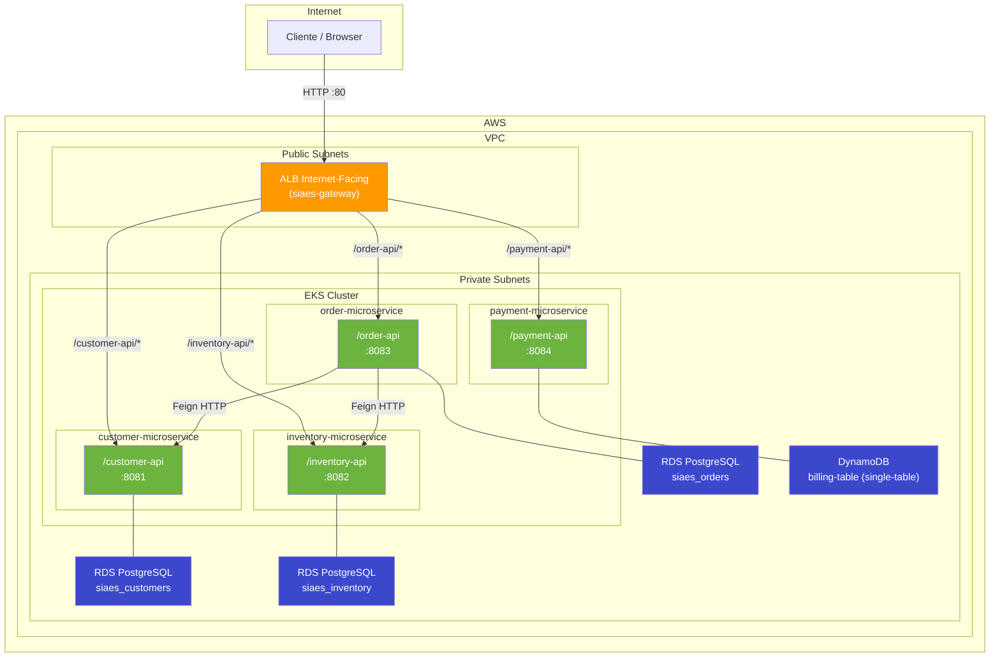
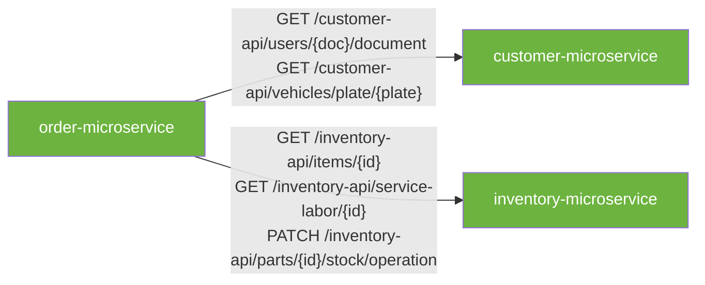
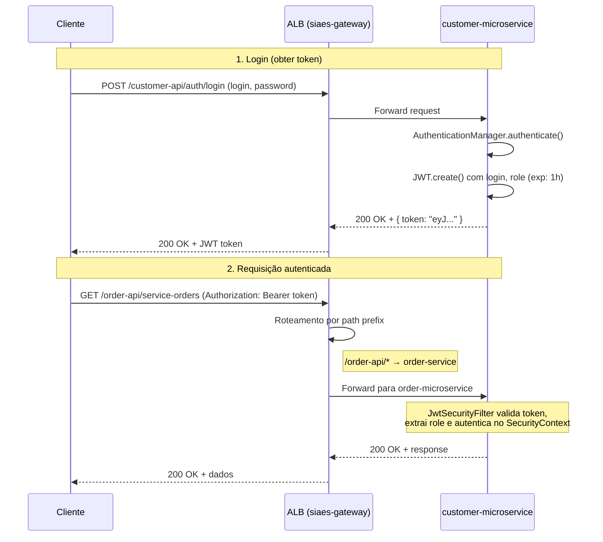
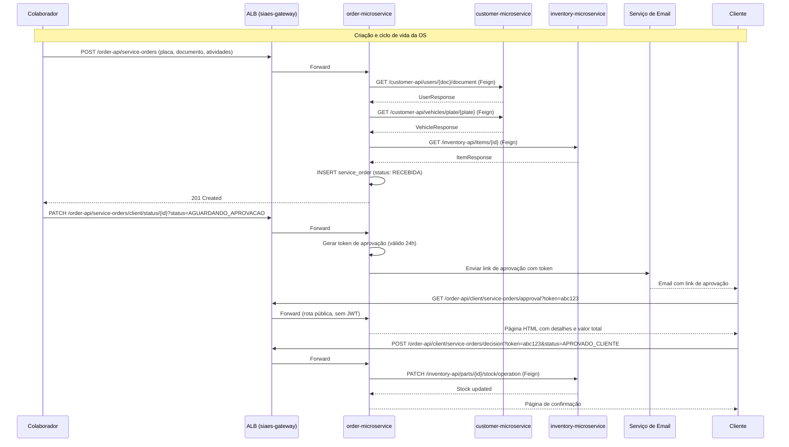
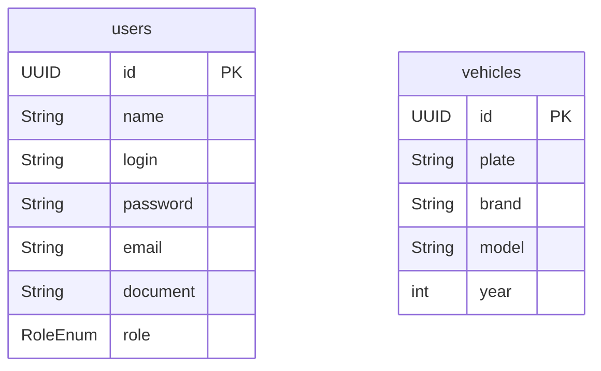
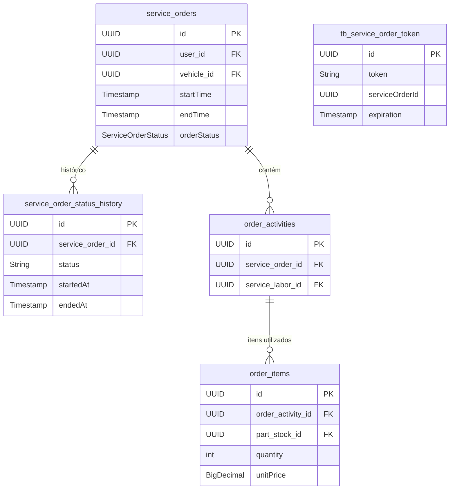
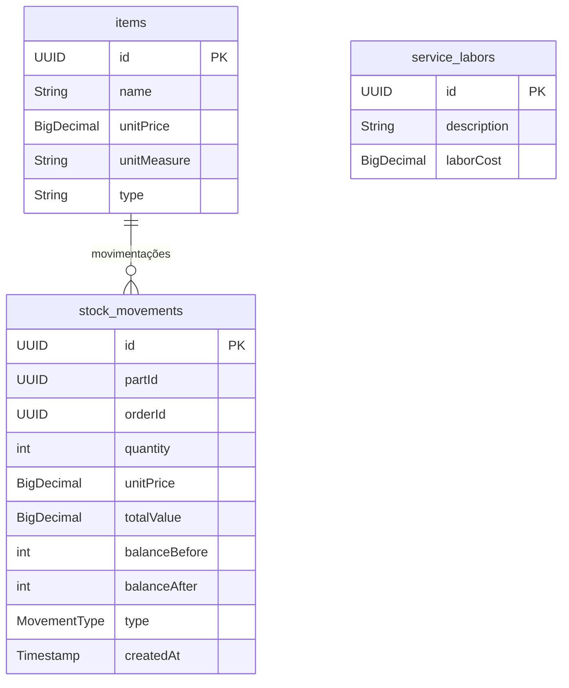

# NullPointerXp

**Pós-Graduação em Arquitetura de Software** | FIAP — SOAT Turma 13

## Sobre o Projeto

O **SIAES** (Sistema Integrado de Atendimento e Execução de Serviços) é uma plataforma para gerenciamento de ordens de serviço, desde o diagnóstico até a finalização, com autenticação via JWT, monitoramento com Datadog e deploy automatizado em AWS.

## Arquitetura

### Visão da Infraestrutura AWS

```
┌─────────────────────────────────────────────────────────────────────────────────────────────┐
│  AWS Cloud                                                                                  │
│                                                                                             │
│  ┌──────────────┐    ┌───────┐    ┌──────────────────┐                                      │
│  │ GitHub Actions│───>│ SonarCloud───>│  ECR (4 repos)   │                                      │
│  └──────────────┘    └───────┘    └──────────────────┘                                      │
│         │                                                                        ┌─────────┐│
│         │  terraform apply                                                       │ Datadog ││
│         v                                                                        └─────────┘│
│  ┌──────────────┐                                                                           │
│  │ S3 Terraform │                                                                           │
│  │   Backend    │                                                                           │
│  └──────────────┘                                                                           │
│                                                                                             │
│  ┌─────────────────────────────────────────────────────────────────────────────────────────┐ │
│  │  VPC                                                                                   │ │
│  │                                                                                        │ │
│  │  ┌──────────────────────────────────────┐  ┌─────────────────────────────────────────┐  │ │
│  │  │  Public Subnets                      │  │  Private Subnets                        │  │ │
│  │  │                                      │  │                                         │  │ │
│  │  │  ┌────────────────┐  ┌────────────┐  │  │  ┌───────────────────────────────────┐  │  │ │
│  │  │  │ Internet       │  │ NAT        │  │  │  │  EKS Cluster                      │  │  │ │
│  │  │  │ Gateway        │  │ Gateway    │──│──│─>│                                   │  │  │ │
│  │  │  └───────┬────────┘  └────────────┘  │  │  │  ┌──────┐ ┌──────┐ ┌──────┐ ┌──────┐ │  │  │ │
│  │  │          │                           │  │  │  │cust. │ │order │ │inven.│ │paymt │ │  │  │ │
│  │  │  ┌───────v────────────────────────┐  │  │  │  │ pod  │ │ pod  │ │ pod  │ │ pod  │ │  │  │ │
│  │  │  │ ALB Internet-Facing            │  │  │  │  │:8081 │ │:8083 │ │:8082 │ │:8084 │ │  │  │ │
│  │  │  │ (siaes-gateway)                │──│──│─>│  └──┬───┘ └──┬───┘ └──┬───┘ └──┬───┘ │  │  │ │
│  │  │  │                                │  │  │  │     │        │        │        │       │  │  │ │
│  │  │  │  /customer-api/*  ─> :8081     │  │  │  └─────│────────│────────│────────│───────┘  │  │ │
│  │  │  │  /order-api/*     ─> :8083     │  │  │        │        │        │                  │  │ │
│  │  │  │  /inventory-api/* ─> :8082     │  │  │        │        │        │                  │  │ │
│  │  │  │  /payment-api/*   ─> :8084     │  │  │  ┌─────v──┐ ┌──v───┐ ┌──v───┐ ┌───────────┐ │  │ │
│  │  │  └────────────────────────────────┘  │  │  │  RDS   │ │ RDS  │ │ RDS  │ │ DynamoDB  │ │  │ │
│  │  │                                      │  │  │customers│ │orders│ │inven.│ │billing tbl│ │  │ │
│  │  └──────────────────────────────────────┘  │  └────────┘ └──────┘ └──────┘ └───────────┘ │  │ │
│  │                                            │                                         │  │ │
│  │                                            └─────────────────────────────────────────┘  │ │
│  └─────────────────────────────────────────────────────────────────────────────────────────┘ │
│                                                                                             │
└─────────────────────────────────────────────────────────────────────────────────────────────┘

         ^
         │  HTTP :80
    ┌────┴────┐
    │ Cliente │
    └─────────┘
```

### Visão Detalhada dos Componentes


```mermaid
graph TB
    subgraph Internet
        Client[Cliente / Browser]
    end

    subgraph AWS
        subgraph VPC
            subgraph Public Subnets
                ALB["ALB Internet-Facing<br/>(siaes-gateway)"]
            end

            subgraph Private Subnets
                subgraph EKS Cluster
                    direction TB

                    subgraph customer-pod["customer-microservice"]
                        CS["/customer-api<br/>:8081"]
                    end

                    subgraph order-pod["order-microservice"]
                        OS["/order-api<br/>:8083"]
                    end

                    subgraph inventory-pod["inventory-microservice"]
                        IS["/inventory-api<br/>:8082"]
                    end

                    subgraph payment-pod["payment-microservice"]
                        PS["/payment-api<br/>:8084"]
                    end
                end

                RDS_C["RDS PostgreSQL<br/>siaes_customers"]
                RDS_O["RDS PostgreSQL<br/>siaes_orders"]
                RDS_I["RDS PostgreSQL<br/>siaes_inventory"]
                DDB["DynamoDB<br/>billing-table (single-table)"]
            end
        end
    end

    Client -->|"HTTP :80"| ALB
    ALB -->|"/customer-api/*"| CS
    ALB -->|"/order-api/*"| OS
    ALB -->|"/inventory-api/*"| IS
    ALB -->|"/payment-api/*"| PS

    OS -->|"Feign HTTP"| CS
    OS -->|"Feign HTTP"| IS

    CS --- RDS_C
    OS --- RDS_O
    IS --- RDS_I
    PS --- DDB

    style ALB fill:#FF9900,color:#fff
    style CS fill:#6DB33F,color:#fff
    style OS fill:#6DB33F,color:#fff
    style IS fill:#6DB33F,color:#fff
    style PS fill:#6DB33F,color:#fff
    style RDS_C fill:#3B48CC,color:#fff
    style RDS_O fill:#3B48CC,color:#fff
    style RDS_I fill:#3B48CC,color:#fff
    style DDB fill:#3B48CC,color:#fff
```

### Visão do Fluxo de Requisição

```
                                        ┌──────────────────────┐     ┌─────────────────────┐
                                   ┌───>│  customer-microservice│────>│  RDS siaes_customers │
                                   │    │  /customer-api  :8081 │     └─────────────────────┘
                                   │    └──────────────────────┘
                                   │              ^
┌────────┐    ┌──────────────────┐ │              │ Feign
│ Cliente │───>│  ALB siaes-gateway│─┤              │ + JWT
└────────┘    │  (internet-facing)│ │    ┌──────────────────────┐     ┌─────────────────────┐
              └──────────────────┘ ├───>│  order-microservice   │────>│  RDS siaes_orders    │
                                   │    │  /order-api     :8083 │     └─────────────────────┘
                                   │    └──────────────────────┘
                                   │              │ Feign
                                   │              v + JWT
                                   │    ┌──────────────────────┐     ┌─────────────────────┐
                                   └───>│  inventory-microservice────>│  RDS siaes_inventory │
                                        │  /inventory-api :8082 │     └─────────────────────┘
                                        └──────────────────────┘
```

### Mudanças da Fase 3 para Fase 4

| Aspecto | Fase 3 (Monolito) | Fase 4 (Microserviços) |
|---|---|---|
| **Aplicação** | Monolito `app-siaes` | 4 microserviços independentes |
| **Banco de Dados** | RDS compartilhado | 1 RDS por microserviço relacional; `payment-microservice` usa DynamoDB (single-table) |
| **Autenticação** | Lambda Auth + API Gateway | Spring Security + JWT direto no ALB |
| **Exposição** | ALB interno + API Gateway + VPC Link | ALB internet-facing unificado |
| **Roteamento** | API Gateway com Lambda Authorizer | Kubernetes Ingress Group por context path |
| **Comunicação interna** | N/A (monolito) | OpenFeign com propagação de JWT |

## Repositórios

| Repositório | Descrição | Stack |
|---|---|---|
| [`infra-app`](https://github.com/NullPointerXp/infra-app) | Infraestrutura base — VPC, EKS, ECR, ALB Controller | Terraform, AWS |
| [`infra-db`](https://github.com/NullPointerXp/infra-db) | Banco de dados — RDS PostgreSQL (microserviços relacionais) | Terraform, AWS |
| [`customer-microservice`](https://github.com/NullPointerXp/customer-microservice) | Gestão de usuários, veículos e autenticação JWT | Java 21, Spring Boot, K8s |
| [`order-microservice`](https://github.com/NullPointerXp/order-microservice) | Ordens de serviço, atividades e aprovação por email | Java 21, Spring Boot, K8s |
| [`inventory-microservice`](https://github.com/NullPointerXp/inventory-microservice) | Estoque, peças, mão de obra e movimentações | Java 21, Spring Boot, K8s |
| [`payment-microservice`](https://github.com/NullPointerXp/payment-microservice) | Orçamentos, pagamentos (Mercado Pago) e webhook | Java 21, Spring Boot, DynamoDB, K8s |
| [`k8s`](https://github.com/NullPointerXp/k8s) | Templates Kubernetes — Deployment, Service, Ingress, ConfigMap, HPA | Kubernetes YAML |
| [`github-action`](https://github.com/NullPointerXp/github-action) | Workflows reutilizáveis de CI/CD (Terraform + EKS deploy) | GitHub Actions |
| [`terraform-modules`](https://github.com/NullPointerXp/terraform-modules) | Módulos Terraform reutilizáveis (RDS, ECR, etc.) | Terraform |

> **Repositórios descontinuados na Fase 4:** [`app-siaes`](https://github.com/NullPointerXp/app-siaes) (monolito) e [`lambda-auth`](https://github.com/NullPointerXp/lambda-auth) (Lambda + API Gateway).

## Tech Stack

| Camada | Tecnologias |
|---|---|
| **Aplicação** | Java 21, Spring Boot 3.5, Spring Security, JPA/Hibernate, OpenFeign |
| **Autenticação** | JWT (HMAC256) via Spring Security em cada microserviço |
| **Banco de Dados** | PostgreSQL 15 (RDS) — 1 instância por microserviço relacional; DynamoDB para pagamentos |
| **Infraestrutura** | Terraform, AWS EKS, VPC, ECR, ALB (internet-facing), NAT Gateway |
| **Containers** | Docker, Kubernetes (EKS), HPA |
| **CI/CD** | GitHub Actions — workflows reutilizáveis (build, test, Terraform, deploy) |
| **Qualidade** | SonarCloud, JaCoCo, OWASP Dependency Check |
| **Observabilidade** | Datadog (APM, Logs, Infra), Spring Actuator, Logstash JSON |

## Ambientes

| Ambiente | Branch | Descrição |
|---|---|---|
| **Produção** | `main` | Ambiente principal com alta disponibilidade |
| **Staging** | `stg` | Ambiente de homologação com custos reduzidos |

## Ordem de Deploy (do zero)

```
1. infra-app              →  VPC, EKS, ECR, ALB Controller
2. customer-microservice  →  Terraform (RDS) + Deploy no EKS
3. order-microservice     →  Terraform (RDS) + Deploy no EKS
4. inventory-microservice →  Terraform (RDS) + Deploy no EKS
5. payment-microservice   →  Terraform (DynamoDB + ECR; IAM na role dos nodes do EKS) + Deploy no EKS
```

Cada microserviço provisiona sua própria infraestrutura (RDS ou DynamoDB, ECR) via Terraform e em seguida deploya a aplicação no EKS. O ALB unificado (`siaes-gateway`) é criado automaticamente pelo AWS Load Balancer Controller quando o primeiro Ingress é aplicado.

Para destruir, a ordem é inversa: `payment → inventory → order → customer → infra-app`.

Após merge das alterações em [`github-action`](https://github.com/NullPointerXp/github-action) (outputs `dynamodb_table_name`, inputs de deploy) e em [`k8s`](https://github.com/NullPointerXp/k8s) (ConfigMap/Secret com DynamoDB e Mercado Pago), publique a tag **`v1.0.9`** no repositório `github-action` e use essa tag nos workflows do `payment-microservice` (e, se desejarem, nos outros microserviços). Defina no GitHub os secrets `MP_ACCESS_TOKEN` / `MP_WEBHOOK_SECRET` (prod) e `MP_ACCESS_TOKEN_STG` / `MP_WEBHOOK_SECRET_STG` (staging) para o Mercado Pago.

> Documentação detalhada de deploy e destroy disponível no [README do infra-app](https://github.com/NullPointerXp/infra-app).

---

## Microserviços

### customer-microservice (`/customer-api`)

Responsável pela gestão de usuários, veículos e autenticação.

| Recurso | Endpoints principais |
|---|---|
| **Auth** | `POST /auth/login` |
| **Users** | `GET/POST/PUT/DELETE /users` |
| **Vehicles** | `GET/POST/PUT/DELETE /vehicles` |

### order-microservice (`/order-api`)

Responsável pelas ordens de serviço, atividades e fluxo de aprovação.

| Recurso | Endpoints principais |
|---|---|
| **Service Orders** | `GET/POST /service-orders`, `PATCH /status` |
| **Aprovação** | `GET /client/service-orders/approval?token=...` |
| **Activities** | `GET/POST /order-activities` |
| **Items** | `GET/POST /order-items` |

### inventory-microservice (`/inventory-api`)

Responsável pelo estoque, peças, serviços e movimentações.

| Recurso | Endpoints principais |
|---|---|
| **Items (Parts)** | `GET/POST/PUT/DELETE /parts` |
| **Service Labor** | `GET/POST/PUT/DELETE /service-labor` |
| **Stock** | `PATCH /parts/{id}/stock/operation` |

### payment-microservice (`/payment-api`)

Orçamentos e pagamentos com integração Mercado Pago; persistência em **DynamoDB** (tabela single-table com GSI).

| Recurso | Endpoints principais |
|---|---|
| **Budgets** | Base `/payment-service/budget` (com `context_path` `/payment-api`: `/payment-api/payment-service/budget/...`) |
| **Payments** | Base `/payment-service/payment` |
| **Webhook Mercado Pago** | `POST /payment-service/webhook/mercado-pago` — URL pública do MP deve apontar para o ALB (ex.: `https://<alb>/payment-api/payment-service/webhook/mercado-pago`); secrets `MP_ACCESS_TOKEN` / `MP_WEBHOOK_SECRET` no GitHub Actions |

### Comunicação entre Microserviços


```mermaid
graph LR
    Order["order-microservice"]
    Customer["customer-microservice"]
    Inventory["inventory-microservice"]

    Order -->|"GET /customer-api/users/{doc}/document<br/>GET /customer-api/vehicles/plate/{plate}"| Customer
    Order -->|"GET /inventory-api/items/{id}<br/>GET /inventory-api/service-labor/{id}<br/>PATCH /inventory-api/parts/{id}/stock/operation"| Inventory

    style Order fill:#6DB33F,color:#fff
    style Customer fill:#6DB33F,color:#fff
    style Inventory fill:#6DB33F,color:#fff
```

O `order-microservice` comunica-se com `customer` e `inventory` via **OpenFeign**, propagando o JWT do header `Authorization` automaticamente via `FeignClientInterceptor`.

---

## Diagramas de Sequência

### Fluxo de Autenticação


```mermaid
sequenceDiagram
    participant Client as Cliente
    participant ALB as ALB (siaes-gateway)
    participant Customer as customer-microservice

    Note over Client,Customer: 1. Login (obter token)
    Client->>ALB: POST /customer-api/auth/login (login, password)
    ALB->>Customer: Forward request
    Customer->>Customer: AuthenticationManager.authenticate()
    Customer->>Customer: JWT.create() com login, role (exp: 1h)
    Customer-->>ALB: 200 OK + { token: "eyJ..." }
    ALB-->>Client: 200 OK + JWT token

    Note over Client,Customer: 2. Requisição autenticada
    Client->>ALB: GET /order-api/service-orders (Authorization: Bearer token)
    ALB->>ALB: Roteamento por path prefix
    Note right of ALB: /order-api/* → order-service
    ALB->>Customer: Forward para order-microservice
    Note over Customer: JwtSecurityFilter valida token,<br/>extrai role e autentica no SecurityContext
    Customer-->>ALB: 200 OK + response
    ALB-->>Client: 200 OK + dados
```

### Fluxo de Ordem de Serviço


```mermaid
sequenceDiagram
    participant Colab as Colaborador
    participant ALB as ALB (siaes-gateway)
    participant Order as order-microservice
    participant Customer as customer-microservice
    participant Inventory as inventory-microservice
    participant Email as Serviço de Email
    participant Cliente as Cliente

    Note over Colab,Cliente: Criação e ciclo de vida da OS

    Colab->>ALB: POST /order-api/service-orders (placa, documento, atividades)
    ALB->>Order: Forward
    Order->>Customer: GET /customer-api/users/{doc}/document (Feign)
    Customer-->>Order: UserResponse
    Order->>Customer: GET /customer-api/vehicles/plate/{plate} (Feign)
    Customer-->>Order: VehicleResponse
    Order->>Inventory: GET /inventory-api/items/{id} (Feign)
    Inventory-->>Order: ItemResponse
    Order->>Order: INSERT service_order (status: RECEBIDA)
    Order-->>Colab: 201 Created

    Colab->>ALB: PATCH /order-api/service-orders/client/status/{id}?status=AGUARDANDO_APROVACAO
    ALB->>Order: Forward
    Order->>Order: Gerar token de aprovação (válido 24h)
    Order->>Email: Enviar link de aprovação com token

    Email-->>Cliente: Email com link de aprovação

    Cliente->>ALB: GET /order-api/client/service-orders/approval?token=abc123
    ALB->>Order: Forward (rota pública, sem JWT)
    Order-->>Cliente: Página HTML com detalhes e valor total

    Cliente->>ALB: POST /order-api/client/service-orders/decision?token=abc123&status=APROVADO_CLIENTE
    ALB->>Order: Forward
    Order->>Inventory: PATCH /inventory-api/parts/{id}/stock/operation (Feign)
    Inventory-->>Order: Stock updated
    Order-->>Cliente: Página de confirmação
```

---

## Modelo de Dados (Diagrama ER)

### customer-microservice (siaes_customers)


```mermaid
erDiagram
    users {
        UUID id PK
        String name
        String login
        String password
        String email
        String document
        RoleEnum role
    }

    vehicles {
        UUID id PK
        String plate
        String brand
        String model
        int year
    }
```

### order-microservice (siaes_orders)


```mermaid
erDiagram
    service_orders {
        UUID id PK
        UUID user_id FK
        UUID vehicle_id FK
        Timestamp startTime
        Timestamp endTime
        ServiceOrderStatus orderStatus
    }

    service_order_status_history {
        UUID id PK
        UUID service_order_id FK
        String status
        Timestamp startedAt
        Timestamp endedAt
    }

    tb_service_order_token {
        UUID id PK
        String token
        UUID serviceOrderId
        Timestamp expiration
    }

    order_activities {
        UUID id PK
        UUID service_order_id FK
        UUID service_labor_id FK
    }

    order_items {
        UUID id PK
        UUID order_activity_id FK
        UUID part_stock_id FK
        int quantity
        BigDecimal unitPrice
    }

    service_orders ||--o{ order_activities : "contém"
    service_orders ||--o{ service_order_status_history : "histórico"
    order_activities ||--o{ order_items : "itens utilizados"
```

### inventory-microservice (siaes_inventory)


```mermaid
erDiagram
    items {
        UUID id PK
        String name
        BigDecimal unitPrice
        String unitMeasure
        String type
    }

    service_labors {
        UUID id PK
        String description
        BigDecimal laborCost
    }

    stock_movements {
        UUID id PK
        UUID partId
        UUID orderId
        int quantity
        BigDecimal unitPrice
        BigDecimal totalValue
        int balanceBefore
        int balanceAfter
        MovementType type
        Timestamp createdAt
    }

    items ||--o{ stock_movements : "movimentações"
```

### Justificativa do Banco de Dados

**Por que Database-per-Service?**

- **Desacoplamento**: Cada microserviço gerencia seu schema independentemente, sem risco de breaking changes cruzadas
- **Escalabilidade**: Cada banco pode ser escalado (vertical ou horizontalmente) de acordo com a carga do serviço
- **Autonomia de deploy**: Atualizações de schema (via `hibernate.ddl-auto=update`) não impactam outros serviços
- **Isolamento de falhas**: Se o RDS do inventory falhar, customer e order continuam funcionando para operações que não dependem de estoque

**Por que PostgreSQL?**

- **Modelo relacional**: Ordens de serviço são inerentemente relacionais — OS pertence a um cliente e a um veículo, contém atividades, que por sua vez contêm itens vinculados ao estoque
- **ACID**: Operações críticas como movimentação de estoque e transições de status exigem transações atômicas
- **Compatibilidade**: Driver nativo e Hibernate dialect maduro para Spring Boot
- **Custo**: RDS PostgreSQL `db.t3.micro` no Free Tier da AWS

---

## RFCs (Request for Comments)

### RFC-001: Escolha da Nuvem AWS

**Contexto:** Necessidade de hospedar a aplicação em nuvem pública com serviços gerenciados.

**Decisão:** AWS foi escolhida como provedor de nuvem.

**Justificativa:**
- Maior ecossistema de serviços gerenciados (EKS, RDS, ECR, ALB)
- Free Tier generoso para ambiente acadêmico (RDS, S3)
- Terraform possui módulos oficiais maduros para todos os serviços utilizados
- EKS permite usar Kubernetes padrão sem vendor lock-in no orquestrador

**Alternativas consideradas:**
- **GCP (GKE)**: Kubernetes com boa experiência, mas menor Free Tier para RDS equivalente (Cloud SQL)
- **Azure (AKS)**: AKS é gratuito (só paga nodes), mas o ecossistema Terraform é menos maduro

---

### RFC-002: Estratégia de Autenticação (Fase 4)

**Contexto:** Na Fase 3, a autenticação era feita via Lambda Authorizer + API Gateway. Na Fase 4, com a migração para microserviços e ALB unificado, a estratégia foi simplificada.

**Decisão:** Autenticação via JWT com Spring Security diretamente em cada microserviço.

**Justificativa:**
- **Eliminação de componentes**: Remove Lambda Auth, API Gateway e VPC Link — reduz custo e complexidade
- **Stateless**: JWT não requer sessão no servidor, compatível com auto-scaling do EKS (HPA)
- **ALB como gateway**: O ALB unificado (Ingress Group) roteia por path prefix, substituindo o API Gateway
- **Propagação de token**: O `FeignClientInterceptor` repassa o JWT entre microserviços automaticamente
- **Aprovação sem login**: O fluxo de aprovação de OS pelo cliente usa tokens temporários (24h) acessíveis via link público

**Fluxo:**
1. `POST /customer-api/auth/login` → Spring Security valida login + senha → retorna JWT (1h)
2. Demais rotas → `JwtSecurityFilter` valida o token → autoriza por role (ADMIN, COLLABORATOR, CLIENT)
3. Chamadas entre serviços → OpenFeign com `Authorization: Bearer` propagado automaticamente

**Alternativas consideradas:**
- **Manter Lambda Auth + API Gateway**: Funcional, mas adiciona latência e custo desnecessários para o escopo
- **Cognito**: Mais completo (MFA, social login), mas overengineering para o escopo

---

### RFC-003: Escolha do Banco de Dados

**Contexto:** Necessidade de persistir dados de usuários, veículos, ordens de serviço, estoque e histórico.

**Decisão:** PostgreSQL 15 via AWS RDS, com database-per-service (1 instância por microserviço).

**Justificativa:**
- Modelo de dados relacional com integridade referencial obrigatória (FK entre OS → atividades, itens)
- Transações ACID para operações críticas (movimentação de estoque + mudança de status)
- Hibernate/JPA oferecem suporte de primeiro nível ao PostgreSQL
- RDS elimina gerenciamento de backup, patching e replicação
- `db.t3.micro` é elegível ao Free Tier da AWS

**Alternativas consideradas:**
- **MySQL (RDS)**: Viável, mas PostgreSQL tem melhor suporte a tipos complexos e herança de tabela
- **DynamoDB**: Inadequado — o modelo possui relações N:N e queries complexas que demandam JOINs
- **Banco compartilhado**: Viola o princípio de autonomia dos microserviços

---

## ADRs (Architecture Decision Records)

### ADR-001: Kubernetes (EKS) como Orquestrador

**Status:** Aceito

**Contexto:** A aplicação precisa de deploy automatizado, auto-scaling e self-healing.

**Decisão:** Usar AWS EKS com managed node groups.

**Consequências:**
- (+) HPA escala automaticamente baseado em CPU (60%) e memória (70%)
- (+) Probes (startup, readiness, liveness) garantem self-healing
- (+) Rolling updates com zero downtime via Deployment strategy
- (+) AWS Load Balancer Controller cria ALBs automaticamente a partir de Ingress
- (-) EKS tem custo fixo de ~$73/mês pelo control plane
- (-) Curva de aprendizado maior que ECS/Fargate

---

### ADR-002: HPA (Horizontal Pod Autoscaler)

**Status:** Aceito

**Contexto:** A carga de trabalho varia — picos em horários comerciais, ocioso à noite.

**Decisão:** HPA com min 1, max 5 réplicas, baseado em CPU e memória.

**Configuração:**
- CPU target: 60% de utilização média
- Memory target: 70% de utilização média
- Scale up: até 100% de aumento, estabilização de 30s
- Scale down: até 50% de redução, estabilização de 30s

**Consequências:**
- (+) Custo otimizado — 1 réplica em baixa carga, até 5 em pico
- (+) Resposta automática a aumentos de demanda
- (-) Java (Spring Boot) tem cold start de ~60s, coberto pelo startupProbe (5 min timeout)

---

### ADR-003: ALB Unificado com Ingress Group (Fase 4)

**Status:** Aceito (substitui ADR-003 da Fase 3: API Gateway como Ponto de Entrada Único)

**Contexto:** Na Fase 3, o ponto de entrada era o API Gateway com Lambda Authorizer e VPC Link para um ALB interno. Na Fase 4, com a migração para microserviços, essa arquitetura foi simplificada.

**Decisão:** ALB internet-facing unificado via AWS Load Balancer Controller com Kubernetes Ingress Group.

**Configuração:**
- Todos os Ingresses compartilham `group.name: siaes-gateway`
- Cada microserviço define seu `context_path` (`/customer-api`, `/order-api`, `/inventory-api`, `/payment-api`)
- `group.order` define prioridade de roteamento (10, 20, 30)
- Autenticação é feita dentro de cada microserviço via Spring Security

**Consequências:**
- (+) Remove 3 componentes AWS (Lambda Auth, API Gateway, VPC Link) — reduz custo e latência
- (+) Um único ALB serve todos os microserviços — roteamento por path prefix
- (+) Cada microserviço controla suas próprias regras de segurança (flexibilidade)
- (+) Health check por microserviço (`/order-api/actuator/health`)
- (-) Perde rate limiting nativo do API Gateway (pode ser adicionado com Nginx Ingress no futuro)
- (-) ALB é exposto diretamente à internet (mitigado por Spring Security + JWT)

---

### ADR-004: Infraestrutura como Código com Terraform

**Status:** Aceito

**Contexto:** Necessidade de reprodutibilidade, versionamento e automação da infraestrutura.

**Decisão:** Terraform com módulos reutilizáveis e state remoto no S3.

**Consequências:**
- (+) Ambientes prod e stg criados a partir dos mesmos módulos com valores diferentes
- (+) State no S3 permite colaboração e uso tanto local quanto via GitHub Actions
- (+) Destroy e recreate confiável — o state sabe exatamente o que foi criado
- (+) Remote state entre projetos (microserviços leem outputs do infra-app)
- (-) Requer conhecimento de HCL e da API da AWS

---

### ADR-005: Decomposição em Microserviços (Fase 4)

**Status:** Aceito (evolução do ADR-005 da Fase 3: Separação em 4 Repositórios)

**Contexto:** Na Fase 3, o sistema era um monolito (`app-siaes`). Na Fase 4, foi decomposto em microserviços seguindo Domain-Driven Design (evoluindo de três para quatro serviços com `payment-microservice`).

**Decisão:** Decompor em `customer-microservice`, `order-microservice`, `inventory-microservice` e `payment-microservice`, cada um com persistência e pipeline CI/CD alinhados ao domínio.

| Microserviço | Domínio | Persistência | Context Path |
|---|---|---|---|
| `customer-microservice` | Usuários, Veículos, Auth | RDS `siaes_customers` | `/customer-api` |
| `order-microservice` | Ordens de Serviço, Atividades | RDS `siaes_orders` | `/order-api` |
| `inventory-microservice` | Estoque, Peças, Mão de Obra | RDS `siaes_inventory` | `/inventory-api` |
| `payment-microservice` | Orçamentos, Pagamentos | DynamoDB (ex.: `billing-table-{env}`) | `/payment-api` |

**Consequências:**
- (+) Deploy independente — mudar o order não rebuilda o customer
- (+) Escalabilidade independente — HPA por microserviço
- (+) Database-per-service — isolamento total de dados
- (+) CI/CD mais rápido — cada repo builda apenas o que é seu
- (-) Complexidade de comunicação — OpenFeign com propagação de JWT
- (-) Consistência eventual — sem transações distribuídas (aceitável para o domínio)

---

### ADR-006: Workflows Reutilizáveis de CI/CD

**Status:** Aceito

**Contexto:** Com vários microserviços com pipelines semelhantes (Terraform + build + deploy EKS), manter workflows duplicados gera custo de manutenção.

**Decisão:** Criar workflows reutilizáveis no repositório `github-action`, versionados com tags semânticas.

**Workflows:**
- `reusable-terraform-microservice.yml` — Terraform plan/apply com outputs de RDS e/ou DynamoDB (`dynamodb_table_name`)
- `reusable-java-eks-deploy.yml` — Build Maven, push ECR, apply K8s manifests

**Consequências:**
- (+) Mudança em um workflow aplica a todos os microserviços na próxima versão
- (+) Versionamento por tags (`v1.0.8`) permite rollback independente
- (+) Templates K8s centralizados no repositório `k8s`
- (-) Requer bump de tag e atualização em cada repo para adotar mudanças

---

## Integrantes

| Nome | GitHub |
|---|---|
| Douglas Andrade Severa | [@Douglas-Andrade-Severa](https://github.com/Douglas-Andrade-Severa) |
| Edmar Santos | [@edmarsantos](https://github.com/edmarsantos) |
| Felipe Martines Kurjata | [@Kurjata](https://github.com/Kurjata) |
| Maximiliano Andrade | [maximilianoandrade67-hash](https://github.com/maximilianoandrade67-hash) |
| Vinícius Louzada | [@vinelouzada](https://github.com/vinelouzada) |
