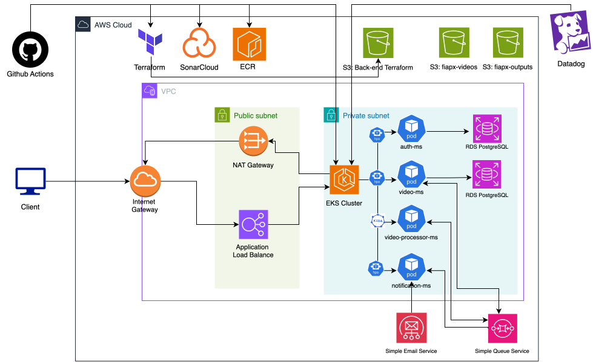
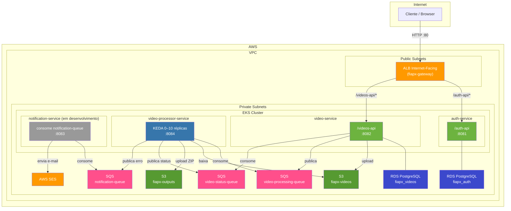
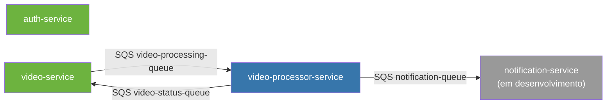
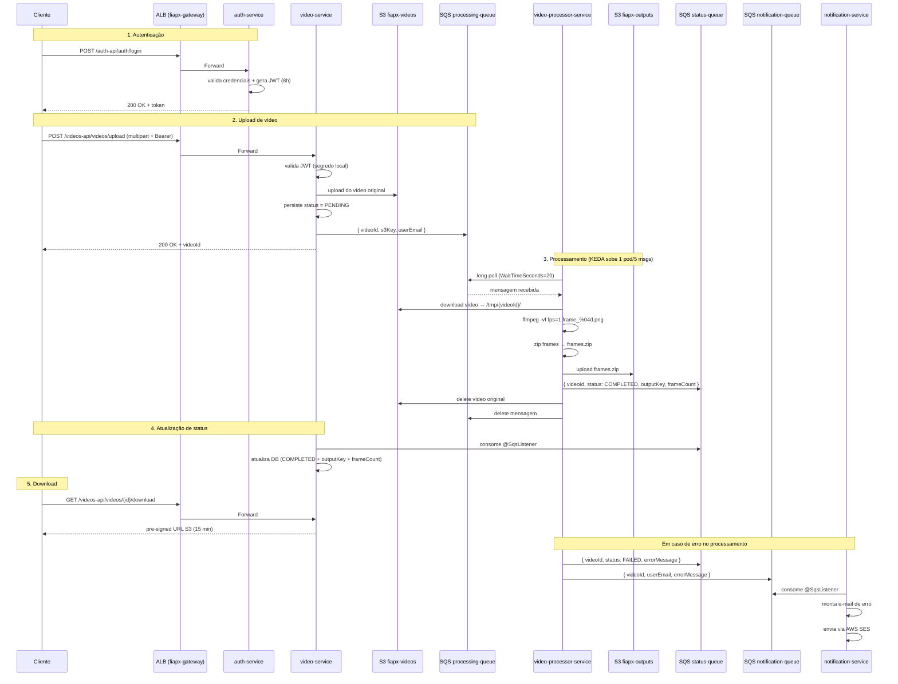
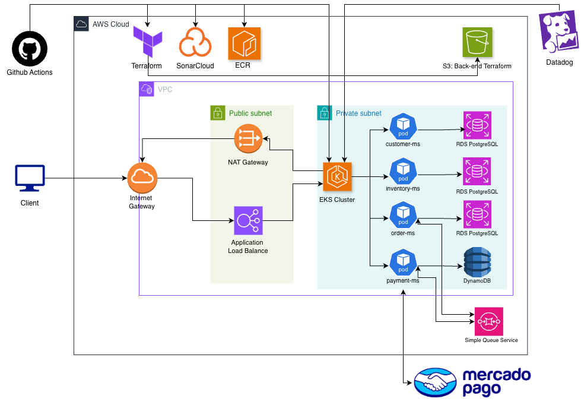
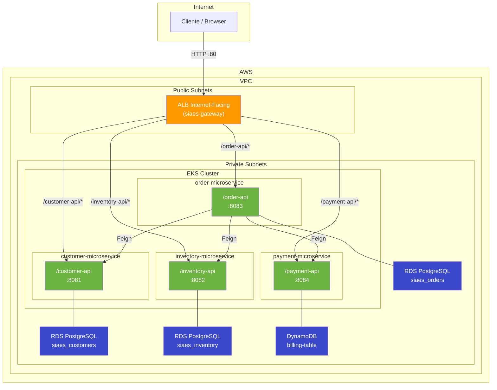
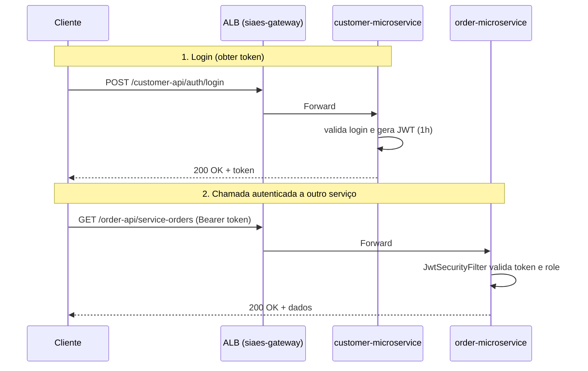
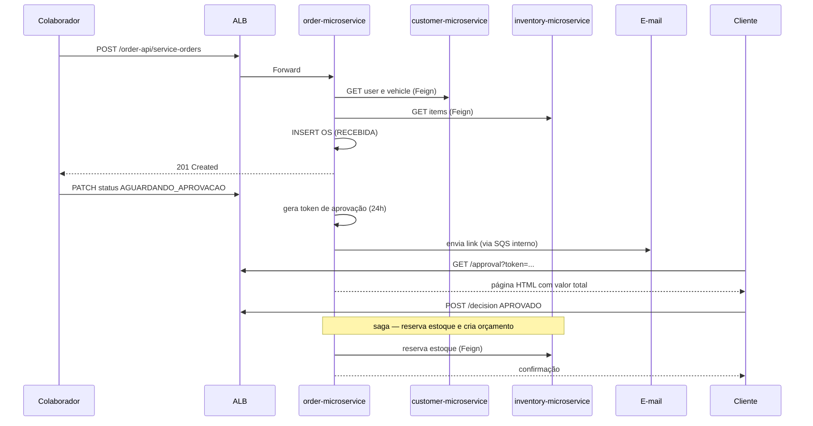

# NullPointerXp

**Pós-Graduação em Arquitetura de Software** | FIAP — SOAT Turma 13

> **Projeto da Fase 4:** [SIAES — Sistema Integrado de Atendimento e Execução de Serviços](#siaes--fase-4)

---

## FIAP X — Sistema de Processamento de Vídeos (Hackathon Fase 5)

O **FIAP X** é uma plataforma para upload, processamento assíncrono e distribuição de vídeos. O usuário autentica, envia um vídeo, e o sistema extrai automaticamente um frame por segundo, empacota em ZIP e disponibiliza para download — tudo orquestrado por filas SQS, escalado por KEDA e construído sobre a mesma infraestrutura AWS do SIAES.

## Arquitetura



### Visão da Infraestrutura AWS

```
┌──────────────────────────────────────────────────────────────────────────────────────────────────────────────┐
│  AWS Cloud                                                                                                   │
│                                                                                                              │
│  ┌──────────────┐    ┌────────────┐    ┌───────────────────┐                                                 │ 
│  │GitHub Actions│───>│ SonarCloud │───>│  ECR (4 repos)    │  ← 1 repo/imagem por serviço/ambiente           │
│  └──────┬───────┘    └────────────┘    └───────────────────┘                                                 │
│         │ build + push (CI de cada microsserviço)                                                            │
│         │ terraform apply                                                                                    │
│         v                                                                                                    │
│  ┌──────────────┐                                                                                            │
│  │ S3 Terraform │   state: infra-app + state por microsserviço (pasta infra/)                                │
│  │   Backend    │                                                                                            │
│  └──────────────┘                                                                                            │
│                                                                                                              │
│  ┌──────────────────────────────────────────────────────────────────────────────────────────────────────┐    │
│  │  VPC  (módulos reutilizados do SIAES via terraform-modules)                                          │    │
│  │                                                                                                      │    │
│  │  ┌──────────────────────────────────────┐   ┌───────────────────────────────────────────────────┐    │    │
│  │  │  Public Subnets                      │   │  Private Subnets                                  │    │    │
│  │  │                                      │   │                                                   │    │    │
│  │  │  ┌────────────────┐  ┌────────────┐  │   │  ┌─────────────────────────────────────────────┐  │    │    │
│  │  │  │ Internet       │  │ NAT        │  │   │  │  EKS Cluster (KEDA instalado via Helm)      │  │    │    │
│  │  │  │ Gateway        │  │ Gateway    │──│───│─>│                                             │  │    │    │
│  │  │  └───────┬────────┘  └────────────┘  │   │  │  ┌──────────┐ ┌──────────┐ ┌───────────┐    │  │    │    │
│  │  │          │                           │   │  │  │   auth   │ │  video   │ │  video-   │    │  │    │    │
│  │  │  ┌───────v────────────────────────┐  │   │  │  │ service  │ │ service  │ │ processor │    │  │    │    │
│  │  │  │ ALB Internet-Facing            │  │   │  │  │  :8081   │ │  :8082   │ │  :8084    │    │  │    │    │
│  │  │  │ (fiapx-gateway)                │──│───│─>│  └──┬───────┘ └──┬───────┘ │ (KEDA     │    │  │    │    │
│  │  │  │                                │  │   │  │     │            │         │  0–10 pod)│    │  │    │    │
│  │  │  │  /auth-api/*    ─> :8081       │  │   │  │     │            │         └─────┬─────┘    │  │    │    │
│  │  │  │  /videos-api/*  ─> :8082       │  │   │  │  ┌──┴───────┐ ┌──┴──────────┐    │          │  │    │    │
│  │  │  └────────────────────────────────┘  │   │  │  │ RDS PG   │ │  RDS PG     │    │(interno) │  │    │    │
│  │  │                                      │   │  │  │fiapx_auth│ │fiapx_videos │    │          │  │    │    │
│  │  └──────────────────────────────────────┘   │  │  └──────────┘ └─────────────┘    │          │  │    │    │
│  │                                             │  │                                  │          │  │    │    │
│  │                                             │  │  ┌───────────────────┐           │          │  │    │    │
│  │                                             │  │  │ notification-svc  │◄──────────┘          │  │    │    │
│  │                                             │  │  │ :8083 (em desenv.)│ ← consome            │  │    │    │
│  │                                             │  │  │ notification-queue│   SQS, envia SES     │  │    │    │
│  │                                             │  │  └───────────────────┘                      │  │    │    │
│  │                                             │  └─────────────────────────────────────────────┘  │    │    │
│  │                                             │                                                   │    │    │
│  │                                             │  ┌───────────────────────────────────────────┐    │    │    │
│  │                                             │  │  Amazon SQS (+ DLQs por fila)             │    │    │    │
│  │                                             │  │  · video-processing-queue (→ processor)   │    │    │    │
│  │                                             │  │  · video-status-queue    (→ video-svc)    │    │    │    │
│  │                                             │  │  · notification-queue    (→ notif-svc)    │    │    │    │
│  │                                             │  └───────────────────────────────────────────┘    │    │    │
│  │                                             │                                                   │    │    │
│  │                                             │  ┌───────────────────────────────────────────┐    │    │    │
│  │                                             │  │  S3 Buckets                               │    │    │    │
│  │                                             │  │  · fiapx-videos   ← uploads originais     │    │    │    │
│  │                                             │  │  · fiapx-outputs  ← ZIPs com frames       │    │    │    │
│  │                                             │  └───────────────────────────────────────────┘    │    │    │
│  │                                             └───────────────────────────────────────────────────┘    │    │
│  └──────────────────────────────────────────────────────────────────────────────────────────────────────┘    │
└──────────────────────────────────────────────────────────────────────────────────────────────────────────────┘

         ^
         │  HTTP :80
    ┌────┴────┐
    │ Cliente │          (upload multipart, JWT obrigatório)
    └─────────┘
```

| Terraform   | Repositório                                   | Recursos principais                                                  |
| ----------- | --------------------------------------------- | -------------------------------------------------------------------- |
| Plataforma  | `infra-app` (reutilizado do SIAES)            | VPC, EKS, KEDA (Helm), ALB, S3 (2 buckets), SQS (3 filas + DLQs)   |
| Por serviço | `*-microservice` / `infra/environments/`      | ECR, RDS PostgreSQL, SES (notification)                              |
| Módulos     | `terraform-modules` (reutilizados do SIAES)   | Blocos reutilizáveis (vpc, eks, rds, sqs, s3, ecr, keda, …)         |


### Visão Detalhada dos Componentes


```mermaid
graph TB
    subgraph Internet
        Client["Cliente / Browser"]
    end

    subgraph AWS
        subgraph VPC
            subgraph Public Subnets
                ALB["ALB Internet-Facing<br/>(fiapx-gateway)"]
            end

            subgraph Private Subnets
                subgraph EKS Cluster
                    direction TB

                    subgraph auth-pod["auth-service"]
                        AS["/auth-api<br/>:8081"]
                    end

                    subgraph video-pod["video-service"]
                        VS["/videos-api<br/>:8082"]
                    end

                    subgraph processor-pod["video-processor-service"]
                        PP["KEDA 0–10 réplicas<br/>:8084"]
                    end

                    subgraph notification-pod["notification-service (em desenvolvimento)"]
                        NS["consome notification-queue<br/>:8083"]
                    end
                end

                RDS_A["RDS PostgreSQL<br/>fiapx_auth"]
                RDS_V["RDS PostgreSQL<br/>fiapx_videos"]
                S3_IN["S3<br/>fiapx-videos"]
                S3_OUT["S3<br/>fiapx-outputs"]
                SQS1["SQS<br/>video-processing-queue"]
                SQS2["SQS<br/>video-status-queue"]
                SQS3["SQS<br/>notification-queue"]
                SES["AWS SES"]
            end
        end
    end

    Client -->|"HTTP :80"| ALB
    ALB -->|"/auth-api/*"| AS
    ALB -->|"/videos-api/*"| VS

    AS --- RDS_A
    VS --- RDS_V
    VS -->|"upload"| S3_IN
    VS -->|"publica"| SQS1
    PP -->|"consome"| SQS1
    PP -->|"baixa"| S3_IN
    PP -->|"upload ZIP"| S3_OUT
    PP -->|"publica status"| SQS2
    PP -->|"publica erro"| SQS3
    VS -->|"consome"| SQS2
    NS -->|"consome"| SQS3
    NS -->|"envia e-mail"| SES

    style ALB fill:#FF9900,color:#fff
    style AS fill:#6DB33F,color:#fff
    style VS fill:#6DB33F,color:#fff
    style PP fill:#3776ab,color:#fff
    style NS fill:#999,color:#fff
    style RDS_A fill:#3B48CC,color:#fff
    style RDS_V fill:#3B48CC,color:#fff
    style S3_IN fill:#569A31,color:#fff
    style S3_OUT fill:#569A31,color:#fff
    style SQS1 fill:#FF4F8B,color:#fff
    style SQS2 fill:#FF4F8B,color:#fff
    style SQS3 fill:#FF4F8B,color:#fff
    style SES fill:#FF9900,color:#fff
```

> **video-processor-service** não é exposto pelo ALB — comunica-se exclusivamente via SQS e S3.
> **notification-service** não é exposto pelo ALB — consome `notification-queue` e envia e-mail via SES.

### Fluxo Completo de Processamento

```
┌─────────┐   ┌───────────────────────┐
│ Cliente │──>│ POST /auth-api/login  │──> JWT (24h, HMAC256)
└────┬────┘   └───────────────────────┘
     │
     │  POST /videos-api/videos/upload (multipart + Bearer JWT)
     ▼
┌──────────────────────────────────────┐
│         video-service (:8082)        │
│  · valida JWT (segredo compartilhado)│
│  · salva vídeo em S3 fiapx-videos    │
│  · persiste: status = PENDING        │
│  · publica video-processing-queue    │
│    { videoId, s3Key, userEmail }     │
└──────────────────────────────────────┘
          │
          │ SQS (video-processing-queue)
          ▼
┌──────────────────────────────────────┐
│   video-processor-service (:8084)    │  ← KEDA escala 0–10 pods por depth da fila
│  a. Download S3 → /tmp/{videoId}/    │
│  b. ffmpeg -vf fps=1 frame_%04d.png  │
│  c. Empacota frames em ZIP           │
│  d. Upload ZIP → S3 fiapx-outputs    │
│  e. Publica video-status-queue       │
│     { videoId, status: COMPLETED,    │
│       outputKey, frameCount }        │
│  f. Em erro: publica status FAILED   │
│     + notification-queue             │
│     { videoId, userEmail, errorMsg } │
│  g. Deleta vídeo original do S3      │
└──────────────────────────────────────┘
          │                    │
          │ video-status-queue │ notification-queue
          ▼                    ▼
┌─────────────────┐   ┌───────────────────────────────┐
│  video-service  │   │  notification-service (:8083) │
│  · atualiza DB  │   │  (em desenvolvimento)         │
│    status /     │   │  · consome fila               │
│    frameCount   │   │  · envia e-mail via AWS SES   │
│    outputKey    │   │    com link de download       │
└─────────────────┘   │    ou mensagem de erro        │
                      └───────────────────────────────┘

Cliente  ──GET /videos-api/videos/user──> lista com status + URL pré-assinada (15 min)
Cliente  ──GET /videos-api/videos/{id}/download──> URL pré-assinada S3 (ZIP com frames)
```

### Decisões Técnicas

| Decisão | Escolha | Razão |
| ------- | ------- | ----- |
| **Auth** | JWT local (Spring Security, HMAC256) | Elimina API GW/Lambda Authorizer; padrão reutilizado do SIAES |
| **Processamento** | FastAPI (Python) + ffmpeg no EKS | Sem limite de 15 min (vs Lambda); mesmo pipeline CI/CD; KEDA = escala a zero |
| **Escala do worker** | KEDA + SQS queue depth | Escala baseada em carga real (1 pod/5 mensagens), não CPU |
| **Mensageria** | SQS (3 filas + DLQs) | Nativo AWS; integração direta com Spring Cloud AWS e KEDA |
| **Storage** | S3 (2 buckets) | Ilimitado; pre-signed URLs; sem disco gerenciado |
| **Auth database** | RDS PostgreSQL | Relacional; padrão do time; Free Tier |
| **Video database** | RDS PostgreSQL | Status + metadados relacionais; FK implícita com userId do JWT |
| **IaC** | Terraform modular (reutilizado do SIAES) | Módulos `terraform-modules` já validados em produção |
| **Django vs FastAPI** | FastAPI | Worker puro sem necessidade de ORM/admin; mais leve |
| **Notificação** | AWS SES | Gerenciado, integrado ao ecossistema AWS; sem SMTP externo |

---

## Repositórios

| Repositório | Descrição | Stack |
| ----------- | --------- | ----- |
| `[infra-app](https://github.com/NullPointerXp/infra-app)` | Plataforma compartilhada — VPC, EKS, KEDA, ALB, S3, SQS (reutilizado do SIAES) | Terraform, AWS, Helm |
| `[auth-microservice](https://github.com/NullPointerXp/auth-microservice)` | Autenticação JWT; registro, login local e Google OAuth | Java 21, Spring Boot, PostgreSQL, K8s |
| `[video-microservice](https://github.com/NullPointerXp/video-microservice)` | Upload de vídeos, coordenação do processamento, download via pre-signed URL | Java 21, Spring Boot, S3, SQS, PostgreSQL, K8s |
| `[video-processor-microservice](https://github.com/NullPointerXp/video-processor-microservice)` | Worker de extração de frames (ffmpeg → ZIP → S3), escalonado por KEDA | Python 3.12, FastAPI, boto3, KEDA |
| `notification-service` | Consome `notification-queue` e envia e-mail via SES com link de download ou mensagem de erro | Java 21, Spring Boot, SQS, AWS SES, K8s |
| `[terraform-modules](https://github.com/NullPointerXp/terraform-modules)` | Módulos compartilhados reutilizados do SIAES (vpc, eks, rds, sqs, s3, ecr, keda, …) | Terraform |
| `[github-action](https://github.com/NullPointerXp/github-action)` | Workflows reutilizáveis (Terraform + build Maven + build Python + deploy EKS) | GitHub Actions |
| `[k8s](https://github.com/NullPointerXp/k8s)` | Templates K8s (Deployment, Service, Ingress, ConfigMap, HPA, ScaledObject KEDA) | Kubernetes YAML |

> **notification-service** ainda não está implementado. Seguirá o mesmo padrão dos demais serviços Java: Spring Boot no EKS, `@SqsListener` na fila `notification-queue`, envio de e-mail via AWS SES. O Terraform provisionará ECR e a identidade SES; o manifesto K8s seguirá o template do repositório `k8s`.

---

## Microsserviços

### auth-service (`/auth-api`, :8081)

Responsável pelo registro de usuários, autenticação e emissão de JWT.

| Recurso | Endpoints principais | Auth |
| ------- | -------------------- | ---- |
| **Auth local** | `POST /auth/register`, `POST /auth/login` | Público |
| **Auth Google** | `POST /auth/google`, `GET /auth/google/config` | Público |
| **Usuários** | `GET/POST/PUT/DELETE /users` | JWT obrigatório |

**JWT:** HMAC256, access token 8h, refresh token 30 dias. O mesmo `JWT_SECRET` (K8s Secret) é compartilhado com `video-service` para validação local — sem chamada HTTP entre serviços para autenticar.

**Terraform:** ECR + RDS PostgreSQL (`fiapx_auth`).

---

### video-service (`/videos-api`, :8082)

Responsável pelo upload, rastreamento de status e disponibilização dos vídeos processados.

| Recurso | Endpoints principais | Auth |
| ------- | -------------------- | ---- |
| **Upload** | `POST /videos/upload` (multipart, ≤ 500 MB, mp4/mov/avi/mkv) | JWT obrigatório |
| **Listagem** | `GET /videos/user` (paginada, filtra por `userId` do token) | JWT obrigatório |
| **Detalhe** | `GET /videos/{id}/id` | JWT obrigatório |
| **Download** | `GET /videos/{id}/download` → pre-signed URL S3 (15 min) | JWT obrigatório |

**Status:** `PENDING → PROCESSING → COMPLETED | FAILED`

**Produz para:** `video-processing-queue` | **Consome de:** `video-status-queue` (Spring Cloud AWS `@SqsListener`)

**Terraform:** ECR + RDS PostgreSQL (`fiapx_videos`) + S3 (`fiapx-videos`, `fiapx-outputs`) + SQS (3 filas + DLQs).

---

### video-processor-service (:8084)

Worker Python que consome `video-processing-queue`, processa o vídeo com ffmpeg, e publica o resultado.

| Componente | Responsabilidade |
| ---------- | ---------------- |
| `config.py` | Variáveis de ambiente (equivale ao `application.properties`) |
| `models.py` | `VideoMessage` dataclass (equivale a um DTO Java) |
| `video_processor.py` | ffmpeg → extração de frames + criação do ZIP |
| `storage.py` | Download S3 input, upload S3 output, deleção do original |
| `queue.py` | Publicação em `video-status-queue` e `notification-queue` |
| `consumer.py` | `SqsConsumer` (long polling) + `VideoProcessingOrchestrator` |
| `main.py` | FastAPI (`GET /health`) + startup do consumer em thread daemon |

**KEDA ScaledObject:** 0 a 10 réplicas; 1 pod por 5 mensagens na fila.

**Dockerfile:** `FROM python:3.12-slim` + `apt-get install -y ffmpeg`

**Terraform:** ECR + IAM role IRSA (S3 read/write + SQS consume/publish).

**Testes:** `pytest` + `moto` (mock S3/SQS, sem AWS real).

---

### notification-service (:8083) — em desenvolvimento

Consome a fila `notification-queue` e envia e-mail via AWS SES informando o link de download do ZIP ou a mensagem de erro do processamento.

Seguirá exatamente o mesmo padrão dos serviços Java do projeto:
- Spring Boot 3.5 + Spring Cloud AWS SQS Listener
- Endpoint `GET /health` para K8s liveness/readiness probes
- Stateless (sem banco de dados próprio)
- Terraform: ECR + identidade SES verificada
- CI/CD: mesmo workflow reutilizável `reusable-java-eks-deploy.yml`

---

### Comunicação entre Serviços


```mermaid
graph LR
    Auth["auth-service"]
    Video["video-service"]
    Processor["video-processor-service"]
    Notif["notification-service<br/>(em desenvolvimento)"]

    Video -->|"SQS video-processing-queue"| Processor
    Processor -->|"SQS video-status-queue"| Video
    Processor -->|"SQS notification-queue"| Notif

    style Auth fill:#6DB33F,color:#fff
    style Video fill:#6DB33F,color:#fff
    style Processor fill:#3776ab,color:#fff
    style Notif fill:#999,color:#fff
```

`auth-service` e `video-service` são os únicos expostos pelo ALB. O `video-processor-service` é puramente interno — comunica-se exclusivamente via SQS e S3. O `notification-service` também é interno, sem rota pública.

---

## Tech Stack

| Camada | Tecnologias |
| ------ | ----------- |
| **Aplicação (Java)** | Java 21, Spring Boot 3.5, Spring Security, JPA/Hibernate, Spring Cloud AWS |
| **Aplicação (Python)** | Python 3.12, FastAPI, uvicorn, boto3, ffmpeg-python |
| **Autenticação** | JWT HMAC256 (Auth0 java-jwt); access token 8h; validado localmente em cada serviço Java |
| **Banco de Dados** | PostgreSQL 15 (RDS) — 1 instância por serviço (auth, video) |
| **Storage** | S3 — `fiapx-videos` (uploads) e `fiapx-outputs` (ZIPs processados); pre-signed URLs |
| **Mensageria** | Amazon SQS — `video-processing-queue`, `video-status-queue`, `notification-queue` + DLQs |
| **Notificação** | AWS SES — enviado pelo `notification-service` em caso de erro ou conclusão |
| **Escala do worker** | KEDA (Kubernetes Event-Driven Autoscaling) — 0 a 10 réplicas por profundidade de fila |
| **Infraestrutura** | Terraform, AWS EKS, VPC, ECR (por serviço), ALB, RDS, S3, SQS, SES, NAT Gateway |
| **Containers** | Docker, Kubernetes (EKS), HPA (serviços Java), KEDA ScaledObject (worker Python) |
| **CI/CD** | GitHub Actions — workflows reutilizáveis (build, test, Terraform, deploy Java e Python) |
| **Qualidade** | SonarCloud, JaCoCo, OWASP Dependency Check (Java); pytest + moto (Python) |

---

## Ambientes

| Ambiente | Branch | Descrição |
| -------- | ------ | --------- |
| **Produção** | `main` | Ambiente principal com alta disponibilidade |
| **Staging** | `stg` | Ambiente de homologação com custos reduzidos |

---

## CI/CD e Repositórios Reutilizáveis

A infraestrutura e o deploy seguem o **mesmo padrão do SIAES**: módulos Terraform centralizados em `terraform-modules`, workflows GitHub Actions centralizados em `github-action`, e manifests Kubernetes em `k8s` — todos versionados por tag e reutilizados via `ref`.

### Repositórios e o que cada um guarda

```
┌─────────────────────────────────────────────────────────────────────────────────────────┐
│  Repositórios da organização (NullPointerXp) — reutilizados do SIAES                    │
├─────────────────────────────────────────────────────────────────────────────────────────┤
│                                                                                         │
│  terraform-modules@v1.2.0          github-action@v1.0.10           k8s (branch main)    │
│  ┌──────────────────────┐          ┌──────────────────────┐        ┌─────────────────┐  │
│  │ vpc/  eks/  ecr/     │          │ reusable-terraform-  │        │ templates/      │  │
│  │ rds/  sqs/  s3/      │          │   microservice.yml   │        │  deployment     │  │
│  │ keda/ … (módulos HCL)│          │ reusable-java-eks-   │        │  service        │  │
│  └──────────┬───────────┘          │   deploy.yml         │        │  ingress        │  │
│             │ git::…?ref=v1.2.0    │ reusable-python-eks- │        │  configmap      │  │
│             │ (source nos .tf)     │   deploy.yml  ← novo │        │  scaledobject   │  │
│             │                      └──────────┬───────────┘        └────────┬────────┘  │
│             │                                 │ uses: …@v1.0.10             │ checkout  │
│             │                                 │ (chamado pelos              │ envsubst  │
│             │                                 │  workflows dos MS)          │           │
│             ▼                                 ▼                             │           │
│  ┌──────────────────────┐          ┌──────────────────────┐◄────────────────┘           │
│  │ infra-app            │          │ *-microservice       │                             │
│  │ environments/        │          │ .github/workflows/   │                             │
│  │   stg/  prod/        │          │   cicd-stg.yml       │                             │
│  │ → VPC, EKS, Helm,    │          │   cicd-prod.yml      │                             │
│  │   KEDA, S3, SQS      │          │ infra/environments/  │                             │
│  │   (consome vpc+eks)  │          │   stg/  prod/        │                             │
│  └──────────┬───────────┘          │ → ECR, RDS, SES, …   │                             │
│             │ remote state S3      │   (consome ecr, rds) │                             │
│             │ (outputs: vpc,       │   lê remote state    │                             │
│             │  cluster, subnets)   │   do infra-app       │                             │
│             └─────────────────────►│                      │                             │
│                                    └──────────────────────┘                             │
└─────────────────────────────────────────────────────────────────────────────────────────┘

         Estado Terraform (S3 bucket tf-state-backend)
         ┌────────────────────────────────────────────────────────────┐
         │  key: fiapx/{stg|prod}/terraform.tfstate   ← infra-app     │
         │  key: …/auth-microservice/…                ← cada serviço  │
         │  key: …/video-microservice/…               ← cada serviço  │
         │  key: …/video-processor-microservice/…     ← cada serviço  │
         └────────────────────────────────────────────────────────────┘
```

| Peça reutilizável | Onde vive | Quem consome | Pin de versão |
| ----------------- | --------- | ------------ | ------------- |
| Módulos Terraform (`vpc`, `eks`, `ecr`, `rds`, `sqs`, `s3`, `keda`, …) | `terraform-modules` | `infra-app` e `infra/environments/*` de cada serviço | `?ref=v1.2.0` no `source` |
| Workflow Terraform (plan/apply) | `github-action` | `infra-app` e microsserviços | `@v1.0.10` |
| Workflow Java + EKS (build Maven, push ECR, kubectl) | `github-action` | auth-service, video-service, notification-service | `@v1.0.10` |
| Workflow Python + EKS (build Docker, push ECR, kubectl) | `github-action` | video-processor-service | `@v1.0.10` |
| Manifests K8s (templates YAML + ScaledObject KEDA) | `k8s` | Job de deploy do `github-action` | branch `main` |

### Fluxo de deploy em um microsserviço

```
  desenvolvedor
       │
       │  git push  (stg  ou  main)
       ▼
┌──────────────────┐     ┌─────────────────────────────────────────────────────────────┐
│ *-microservice   │     │  Job 1: terraform  (reusable-terraform-microservice.yml)    │
│ cicd-stg.yml     │────>│  · checkout do repo do serviço                              │
│ cicd-prod.yml    │     │  · terraform init  (clona terraform-modules via PAT)        │
└──────────────────┘     │  · working_directory: infra/environments/{stg|prod}         │
                         │  · lê remote state do infra-app (VPC, EKS, subnets, SG)     │
                         │  · apply: ECR, RDS, SES (conforme o serviço)                │
                         │  · grava state próprio no S3                                │
                         └────────────────────────────┬────────────────────────────────┘
                                                      │ needs: terraform (sucesso)
                                                      ▼
                           ┌─────────────────────────────────────────────────────────────┐
                           │  Job 2: deploy  (reusable-java-eks-deploy.yml               │
                           │               ou reusable-python-eks-deploy.yml)            │
                           │  Java:   mvn test + package                                 │
                           │  Python: pytest + docker build                              │
                           │  · docker build + push → ECR {service}-{env}                │
                           │  · checkout repo k8s → envsubst em templates/               │
                           │  · injeta envs, secrets (GitHub Secrets)                    │
                           │  · kubectl apply no cluster {stg|prod}                      │
                           │  · Ingress group fiapx-gateway → ALB internet-facing        │
                           │  · (prod) SonarCloud                                        │
                           └────────────────────────────┬────────────────────────────────┘
                                                        ▼
                                              Pods no EKS · tráfego pelo ALB
```

**infra-app** (só plataforma — sem imagem de aplicação):

```
  push em environments/stg/** ou environments/prod/**
       │
       ▼
  reusable-terraform-microservice.yml  →  apply VPC + EKS + KEDA (Helm) + S3 + SQS
       │
       └── outputs no S3  ──►  microsserviços usam data "terraform_remote_state" "infra_app"
```

> **Por que tags (`v1.0.10`, `v1.2.0`)?** Mudanças em `main` dos repos compartilhados não quebram pipelines em produção até cada consumidor atualizar o pin. Rollback = voltar à tag anterior nos workflows ou no `ref` dos módulos.

---

## Ordem de Deploy (do zero)

```
1. infra-app                      →  VPC, EKS, Load Balancer Controller, KEDA (Helm), S3 (2 buckets), SQS (3 filas + DLQs)
2. auth-microservice              →  Terraform (ECR + RDS fiapx_auth) + deploy EKS
3. video-microservice             →  Terraform (ECR + RDS fiapx_videos) + deploy EKS
4. video-processor-microservice   →  Terraform (ECR + IAM IRSA) + deploy EKS + KEDA ScaledObject
5. notification-service           →  Terraform (ECR + SES identity) + deploy EKS   ← em desenvolvimento
```

Cada serviço lê o **remote state** do `infra-app` (VPC, subnets, security group dos nodes). O ALB `fiapx-gateway` nasce no primeiro Ingress aplicado (auth ou video service).

**Destroy (inverso):** `notification → video-processor → video → auth → infra-app`.

**CI/CD:** workflows em cada repo chamam `[github-action](https://github.com/NullPointerXp/github-action)` com pin `@v1.0.10`. Módulos Terraform: `terraform-modules@v1.2.0`.

---

## Diagrama de Sequência — Fluxo Completo


```mermaid
sequenceDiagram
    participant C as Cliente
    participant ALB as ALB (fiapx-gateway)
    participant Auth as auth-service
    participant Video as video-service
    participant S3in as S3 fiapx-videos
    participant SQS1 as SQS processing-queue
    participant Proc as video-processor-service
    participant S3out as S3 fiapx-outputs
    participant SQS2 as SQS status-queue
    participant SQS3 as SQS notification-queue
    participant Notif as notification-service

    Note over C,Auth: 1. Autenticação
    C->>ALB: POST /auth-api/auth/login
    ALB->>Auth: Forward
    Auth->>Auth: valida credenciais + gera JWT (8h)
    Auth-->>C: 200 OK + token

    Note over C,SQS1: 2. Upload de vídeo
    C->>ALB: POST /videos-api/videos/upload (multipart + Bearer)
    ALB->>Video: Forward
    Video->>Video: valida JWT (segredo local)
    Video->>S3in: upload do vídeo original
    Video->>Video: persiste status = PENDING
    Video->>SQS1: { videoId, s3Key, userEmail }
    Video-->>C: 200 OK + videoId

    Note over Proc,S3out: 3. Processamento (KEDA sobe 1 pod/5 msgs)
    Proc->>SQS1: long poll (WaitTimeSeconds=20)
    SQS1-->>Proc: mensagem recebida
    Proc->>S3in: download vídeo → /tmp/{videoId}/
    Proc->>Proc: ffmpeg -vf fps=1 frame_%04d.png
    Proc->>Proc: zip frames → frames.zip
    Proc->>S3out: upload frames.zip
    Proc->>SQS2: { videoId, status: COMPLETED, outputKey, frameCount }
    Proc->>S3in: delete vídeo original
    Proc->>SQS1: delete mensagem

    Note over Video,C: 4. Atualização de status
    Video->>SQS2: consome @SqsListener
    Video->>Video: atualiza DB (COMPLETED + outputKey + frameCount)

    Note over C,C: 5. Download
    C->>ALB: GET /videos-api/videos/{id}/download
    ALB->>Video: Forward
    Video-->>C: pre-signed URL S3 (15 min)

    Note over Proc,Notif: Em caso de erro no processamento
    Proc->>SQS2: { videoId, status: FAILED, errorMessage }
    Proc->>SQS3: { videoId, userEmail, errorMessage }
    Notif->>SQS3: consome @SqsListener
    Notif->>Notif: monta e-mail de erro
    Notif->>Notif: envia via AWS SES
```

---

## ADRs (Architecture Decision Records)

### ADR-001: FastAPI Worker no EKS com KEDA

**Status:** Aceito

**Contexto:** O processamento de vídeo pode levar minutos para arquivos grandes, exige ffmpeg e deve escalar a zero em baixa demanda.

**Decisão:** Worker Python (FastAPI + boto3 + ffmpeg-python) rodando no EKS, escalado pelo KEDA com base na profundidade da `video-processing-queue`.

**Consequências:**
- (+) Sem limite de 15 minutos (diferença crítica vs Lambda)
- (+) KEDA escala de 0 a 10 réplicas — custo zero quando fila vazia
- (+) Mesmo pipeline CI/CD dos serviços Java (Dockerfile → ECR → K8s)
- (+) ffmpeg como binário do sistema no container (`apt-get install -y ffmpeg`)
- (-) Pod Python tem overhead de warm-up menor que Java — menos crítico para o startupProbe

**Alternativas consideradas:**
- **Lambda + Container Image:** limite de 15 min é impeditivo para vídeos longos
- **Django + Celery:** overhead desnecessário para worker puro sem ORM/admin

---

### ADR-002: JWT Compartilhado entre Serviços (sem API Gateway)

**Status:** Aceito

**Contexto:** Todos os serviços Java precisam autenticar o usuário sem centralizar a validação.

**Decisão:** `auth-service` emite o JWT com segredo HMAC256; demais serviços validam localmente com o mesmo segredo via K8s Secret (`JWT_SECRET`).

**Consequências:**
- (+) Remove API Gateway e Lambda Authorizer — reduz custo e latência
- (+) Stateless — compatível com HPA/KEDA
- (+) `video-service` extrai `userId` do token sem chamada HTTP ao `auth-service`
- (-) Rotação do segredo exige atualização coordenada em todos os serviços

---

### ADR-003: SQS + DLQ para Resiliência no Processamento

**Status:** Aceito

**Contexto:** O processamento de vídeo pode falhar (arquivo corrompido, ffmpeg crash, S3 indisponível). O sistema deve tolerar falhas sem perder mensagens.

**Decisão:** Cada fila SQS tem uma DLQ associada. Mensagens que falham N vezes são roteadas para a DLQ; CloudWatch Alarm dispara quando `ApproximateNumberOfMessages > 0` na DLQ.

**Consequências:**
- (+) Mensagens não processadas não são perdidas — ficam na DLQ para análise
- (+) `video-processor-service` não deleta a mensagem em caso de erro — ela retorna após o `visibilityTimeout`
- (+) Monitoramento simples: DLQ > 0 = erro operacional
- (-) Requer limpeza manual da DLQ após investigação

---

### ADR-004: Reutilização da Infraestrutura do SIAES

**Status:** Aceito

**Contexto:** O time já possui módulos Terraform validados em produção (`terraform-modules`) e workflows GitHub Actions reutilizáveis (`github-action`).

**Decisão:** Reaproveitar integralmente os repositórios `terraform-modules`, `github-action` e `k8s` do SIAES, adicionando apenas os módulos `s3` e `keda` ao `terraform-modules` e o workflow `reusable-python-eks-deploy.yml` ao `github-action`.

**Consequências:**
- (+) Curva de aprendizado zero — padrões já conhecidos pelo time
- (+) `infra-app` do SIAES é reutilizado com adição de KEDA (Helm) e S3
- (+) Remote state e pins de versão (`@v1.0.10`, `?ref=v1.2.0`) garantem estabilidade
- (-) Dependência de tag bump coordenado para adotar mudanças nos repos compartilhados

---

### ADR-005: KEDA para Escala do Worker Python

**Status:** Aceito

**Contexto:** A fila `video-processing-queue` tem tráfego em rajadas (picos de upload) e períodos ociosos. Manter pods rodando 24/7 seria desperdício.

**Decisão:** KEDA `ScaledObject` com `minReplicaCount: 0` e `maxReplicaCount: 10`; 1 réplica por 5 mensagens na fila.

**Configuração:**
- `minReplicaCount: 0` — zero pods quando fila vazia (custo zero)
- `maxReplicaCount: 10` — limite de burst
- `queueLength: "5"` — sobe 1 pod a cada 5 mensagens

**Consequências:**
- (+) Custo proporcional à carga real
- (+) `video-processor-service` não precisa de HPA baseado em CPU — a fila é a métrica mais relevante
- (-) Cold start do pod Python (~5s) é negligível em comparação ao tempo de processamento de vídeo

---

### ADR-006: Infraestrutura como Código com Terraform Modular

**Status:** Aceito (herdado do SIAES)

**Contexto:** Necessidade de reprodutibilidade, versionamento e automação da infraestrutura em dois ambientes (stg/prod).

**Decisão:** Terraform com módulos reutilizáveis em `terraform-modules` e state remoto no S3.

**Consequências:**
- (+) Ambientes prod e stg criados a partir dos mesmos módulos com variáveis diferentes
- (+) State no S3 permite colaboração e uso via GitHub Actions e local
- (+) Remote state entre projetos (serviços leem outputs do `infra-app`)
- (-) Requer conhecimento de HCL e da API da AWS

---

### ADR-007: S3 para Storage de Vídeos e Frames

**Status:** Aceito

**Contexto:** Vídeos de até 500 MB precisam de storage durável, acessível pelo `video-service` (upload), pelo `video-processor-service` (download/processamento/upload do ZIP) e pelo cliente (download via pre-signed URL).

**Decisão:** Dois buckets S3 separados — `fiapx-videos` (uploads originais, deletados após processamento) e `fiapx-outputs` (ZIPs com frames, retidos para download).

**Consequências:**
- (+) Pre-signed URLs com expiração de 15 min — cliente baixa direto do S3, sem proxy pelo serviço
- (+) Separação de buckets facilita políticas IAM distintas (processor tem write em outputs, read em videos)
- (+) `video-processor-service` deleta o original após sucesso — reduz custo de storage
- (-) Inconsistência possível se a publicação em SQS falhar após o upload S3 (mitigação: padrão Outbox em produção)

---

## RFCs (Request for Comments)

### RFC-001: Escolha da Nuvem AWS

**Contexto:** Necessidade de hospedar a aplicação em nuvem pública com serviços gerenciados.

**Decisão:** AWS foi escolhida como provedor de nuvem.

**Justificativa:**
- Ecossistema unificado: EKS, S3, SQS, SES, ECR, ALB, RDS, KEDA (via Helm)
- Free Tier adequado para ambiente acadêmico
- `terraform-modules` do SIAES já cobrem todos os serviços necessários
- SQS tem integração nativa com KEDA — autoscale sem configuração adicional

**Alternativas consideradas:**
- **GCP (GKE + Pub/Sub):** KEDA suporta Pub/Sub, mas Free Tier menor e módulos Terraform menos maduros para o time
- **Azure (AKS + Service Bus):** AKS gratuito, mas menor familiaridade do time e sem reutilização dos módulos existentes

---

### RFC-002: Estratégia de Autenticação

**Contexto:** Sistema com múltiplos serviços precisando autenticar o usuário de forma stateless.

**Decisão:** JWT local em cada serviço Java com segredo compartilhado via K8s Secret.

**Fluxo:**
1. `POST /auth-api/auth/login` → `auth-service` valida credenciais → retorna JWT (8h)
2. Demais rotas → `JwtSecurityFilter` valida o token localmente usando `JWT_SECRET`
3. `userId` e `role` extraídos do token — sem chamada HTTP ao `auth-service` em cada request

**Alternativas consideradas:**
- **Cognito:** mais completo (MFA, social login), mas overengineering para o escopo
- **API Gateway + Lambda Authorizer:** funcional, mas adiciona latência e custo; padrão já removido no SIAES

---

### RFC-003: Notificações via AWS SES

**Contexto:** Usuário precisa ser notificado quando o processamento termina (sucesso ou falha).

**Decisão:** `notification-service` consome `notification-queue` (SQS) e envia e-mail via AWS SES.

**Justificativa:**
- SES gerenciado pela AWS — sem SMTP externo, sem servidor de e-mail
- Integração nativa com IAM (IRSA) — sem credenciais em código
- Desacoplamento total: `video-processor-service` publica na fila e não conhece o mecanismo de notificação

**Alternativas consideradas:**
- **SendGrid/Mailgun:** SMTP externo adiciona dependência fora do ecossistema AWS e custo variável
- **SNS:** não suporta templates de e-mail ricos nativamente; SES é mais adequado para e-mails transacionais

---

## Integrantes

| Nome | GitHub |
| ---- | ------ |
| Douglas Andrade Severa | [@Douglas-Andrade-Severa](https://github.com/Douglas-Andrade-Severa) |
| Edmar Santos | [@edmarsantos](https://github.com/edmarsantos) |
| Felipe Martines Kurjata | [@Kurjata](https://github.com/Kurjata) |
| Maximiliano Andrade | [maximilianoandrade67-hash](https://github.com/maximilianoandrade67-hash) |
| Vinícius Louzada | [@vinelouzada](https://github.com/vinelouzada) |

---

---

## SIAES — Fase 4

O **SIAES** (Sistema Integrado de Atendimento e Execução de Serviços) é uma plataforma para gerenciamento de ordens de serviço, desde o diagnóstico até a finalização, com autenticação via JWT, monitoramento com Datadog e deploy automatizado em AWS. É o projeto da **Fase 4 (13SOAT)** da pós-graduação.

## Arquitetura



### Visão da Infraestrutura AWS

```
┌───────────────────────────────────────────────────────────────────────────────────────────────────────────┐
│  AWS Cloud                                                                                                │
│                                                                                                           │
│  ┌──────────────┐    ┌────────────┐    ┌──────────────────┐                                               │
│  │GitHub Actions│───>│ SonarCloud │───>│  ECR (4 repos)   │  ← 1 repo/imagem por MS/ambiente              │
│  └──────┬───────┘    └────────────┘    └──────────────────┘                                               │
│         │ build + push (CI de cada microsserviço)                          ┌─────────┐                    │
│         │ terraform apply                                                  │ Datadog │                    │
│         v                                                                  │ (prod)  │                    │
│  ┌──────────────┐                                                          └─────────┘                    │
│  │ S3 Terraform │   state: infra-app + state por microsserviço (pasta infra/)                             │
│  │   Backend    │                                                                                         │
│  └──────────────┘                                                                                         │
│                                                                                                           │
│  ┌──────────────────────────────────────────────────────────────────────────────────────────────────┐     │  
│  │  VPC  (provisionada pelo infra-app)                                                              │     │
│  │                                                                                                  │     │ 
│  │  ┌──────────────────────────────────────┐  ┌────────────────────────────────────────────────┐    │     │
│  │  │  Public Subnets                      │  │  Private Subnets                               │    │     │ 
│  │  │                                      │  │                                                │    │     │
│  │  │  ┌────────────────┐  ┌────────────┐  │  │  ┌────────────────────────────────────────┐    │    │     │
│  │  │  │ Internet       │  │ NAT        │  │  │  │  EKS Cluster                           │    │    │     │ 
│  │  │  │ Gateway        │  │ Gateway    │──│──│─>│                                        │    │    │     │
│  │  │  └───────┬────────┘  └────────────┘  │  │  │  ┌──────┐ ┌──────┐ ┌──────┐ ┌──────┐   │    │    │     │
│  │  │          │                           │  │  │  │cust. │ │order │ │inven.│ │paymt │   │    │    │     │
│  │  │  ┌───────v────────────────────────┐  │  │  │  │ pod  │ │ pod  │ │ pod  │ │ pod  │   │    │    │     │
│  │  │  │ ALB Internet-Facing            │  │  │  │  │:8081 │ │:8083 │ │:8082 │ │:8084 │   │    │    │     │
│  │  │  │ (siaes-gateway)                │──│──│─>│  └──┬───┘ └──┬───┘ └──┬───┘ └───┬──┘   │    │    │     │
│  │  │  │                                │  │  │  │     │        │        │         │      │    │    │     │
│  │  │  │  /customer-api/*  ─> :8081     │  │  │  └─────┼────────┼────────┼─────────┼──────┘    │    │     │
│  │  │  │  /order-api/*     ─> :8083     │  │  │        │        │        │         │           │    │     │
│  │  │  │  /payment-api/*   ─> :8084     │  │  │   ┌────v────┐ ┌─v────┐ ┌─v────┐ ┌──v───────┐   │    │     │
│  │  │  └────────────────────────────────┘  │  │   │  RDS    │ │ RDS  │ │ RDS  │ │ DynamoDB │   │    │     │
│  │  │                                      │  │   │customers│ │orders│ │inven.│ │ billing  │   │    │     │
│  │  └──────────────────────────────────────┘  │   └─────────┘ └──────┘ └──────┘ └──────────┘   │    │     │
│  │                                            │                                                │    │     │
│  │                                            │  ┌─────────────────────────────────────┐       │    │     │
│  │                                            │  │  Amazon SQS (Terraform por MS)      │       │    │     │
│  │                                            │  │  · awaiting-approval  (order)       │       │    │     │
│  │                                            │  │  · payment-result     (pay → order) │       │    │     │
│  │                                            │  └─────────────────────────────────────┘       │    │     │
│  │                                            └────────────────────────────────────────────────┘    │     │
│  └──────────────────────────────────────────────────────────────────────────────────────────────────┘     │
└───────────────────────────────────────────────────────────────────────────────────────────────────────────┘

         ^
         │  HTTP :80
    ┌────┴────┐
    │ Cliente │          Mercado Pago (webhook) ──HTTP──> ALB /payment-api/.../webhook/...
    └─────────┘
```


| Terraform   | Repositório                              | Recursos principais                                |
| ----------- | ---------------------------------------- | -------------------------------------------------- |
| Plataforma  | `infra-app`                              | VPC, EKS, Load Balancer Controller, Datadog (prod) |
| Por serviço | `*-microservice` / `infra/environments/` | ECR, RDS ou DynamoDB, SQS (quando aplicável)       |
| Módulos     | `terraform-modules`                      | Blocos reutilizáveis (vpc, eks, rds, sqs, …)       |


### Visão Detalhada dos Componentes


```mermaid
graph TB
    subgraph Internet
        Client[Cliente / Browser]
    end

    subgraph AWS
        subgraph VPC
            subgraph Public Subnets
                ALB["ALB Internet-Facing<br/>(siaes-gateway)"]
            end

            subgraph Private Subnets
                subgraph EKS Cluster
                    direction TB

                    subgraph customer-pod["customer-microservice"]
                        CS["/customer-api<br/>:8081"]
                    end

                    subgraph order-pod["order-microservice"]
                        OS["/order-api<br/>:8083"]
                    end

                    subgraph inventory-pod["inventory-microservice"]
                        IS["/inventory-api<br/>:8082"]
                    end

                    subgraph payment-pod["payment-microservice"]
                        PS["/payment-api<br/>:8084"]
                    end
                end

                RDS_C["RDS PostgreSQL<br/>siaes_customers"]
                RDS_O["RDS PostgreSQL<br/>siaes_orders"]
                RDS_I["RDS PostgreSQL<br/>siaes_inventory"]
                DDB["DynamoDB<br/>billing-table"]
            end
        end
    end

    Client -->|"HTTP :80"| ALB
    ALB -->|"/customer-api/*"| CS
    ALB -->|"/order-api/*"| OS
    ALB -->|"/inventory-api/*"| IS
    ALB -->|"/payment-api/*"| PS

    OS -->|"Feign"| CS
    OS -->|"Feign"| IS
    OS -->|"Feign"| PS

    CS --- RDS_C
    OS --- RDS_O
    IS --- RDS_I
    PS --- DDB

    style ALB fill:#FF9900,color:#fff
    style CS fill:#6DB33F,color:#fff
    style OS fill:#6DB33F,color:#fff
    style IS fill:#6DB33F,color:#fff
    style PS fill:#6DB33F,color:#fff
    style RDS_C fill:#3B48CC,color:#fff
    style RDS_O fill:#3B48CC,color:#fff
    style RDS_I fill:#3B48CC,color:#fff
    style DDB fill:#3B48CC,color:#fff
```


> **SQS** (não aparece no desenho acima para não poluir): fila de e-mail de aprovação no `order`; fila de resultado de pagamento do `payment` para o `order`. Ver [Saga Orchestrator](#saga-orchestrator-order-microservice).

### Visão do Fluxo de Requisição

Requisições **síncronas** (HTTP pelo ALB):

```
                                         ┌───────────────────────┐     ┌──────────────────────┐
                                    ┌───>│  customer-microservice│────>│  RDS siaes_customers │
                                    │    │  /customer-api  :8081 │     └──────────────────────┘
                                    │    └───────────────────────┘
                                    │              ^
┌─────────┐   ┌───────────────────┐ │              │ Feign + JWT
│ Cliente │──>│  ALB siaes-gateway│─┤              │
└─────────┘   │  (internet-facing)│ │    ┌───────────────────────┐     ┌──────────────────────┐
              └───────────────────┘ ├───>│  order-microservice   │────>│  RDS siaes_orders    │
                                    │    │  /order-api     :8083 │     └──────────────────────┘
                                    │    └───────────────────────┘
                                    │              │ Feign + JWT
                                    │              v
                                    │    ┌────────────────────────┐     ┌──────────────────────┐
                                    └───>│  inventory-microservice│ ───>│  RDS siaes_inventory │
                                         │  /inventory-api :8082  │     └──────────────────────┘
                                         └────────────────────────┘

              Mesmo ALB  ──────────>   payment-microservice /payment-api :8084  ──>  DynamoDB
                                       (webhook Mercado Pago também entra pelo ALB)
```

Requisições **assíncronas** (mensageria):

```
  order ──publica──> SQS awaiting-approval ──consome──> order (envia e-mail ao cliente)

  Mercado Pago ──webhook──> payment ──publica──> SQS payment-result ──consome──> order (atualiza OS)
```

### Mudanças da Fase 3 para Fase 4


| Aspecto                     | Fase 3 (Monolito)                    | Fase 4 (Microserviços)                                                      |
| --------------------------- | ------------------------------------ | --------------------------------------------------------------------------- |
| **Aplicação**               | Monolito `app-siaes`                 | 4 microserviços independentes                                               |
| **Banco de Dados**          | RDS compartilhado                    | 1 RDS por serviço relacional; `payment` usa DynamoDB (single-table)         |
| **Autenticação**            | Lambda Auth + API Gateway            | Spring Security + JWT no ALB                                                |
| **Exposição**               | ALB interno + API Gateway + VPC Link | ALB internet-facing unificado (Ingress Group)                               |
| **Roteamento**              | API Gateway com Lambda Authorizer    | Ingress Kubernetes por `context_path`                                       |
| **Comunicação interna**     | N/A (monolito)                       | OpenFeign (+ JWT) e SQS para eventos de domínio                             |
| **Transações distribuídas** | Transação local única                | **Saga orchestrator** no `order-microservice` (compensações explícitas)     |
| **IaC**                     | Stack monolítica                     | `infra-app` (plataforma) + `infra/` por microsserviço + `terraform-modules` |


## Repositórios


| Repositório                                                                         | Descrição                                                                     | Stack                               |
| ----------------------------------------------------------------------------------- | ----------------------------------------------------------------------------- | ----------------------------------- |
| `[infra-app](https://github.com/NullPointerXp/infra-app)`                           | Plataforma compartilhada — VPC, EKS, Load Balancer Controller, Datadog (prod) | Terraform, AWS, Helm                |
| `[customer-microservice](https://github.com/NullPointerXp/customer-microservice)`   | Usuários, veículos, autenticação JWT                                          | Java 21, Spring Boot, K8s           |
| `[order-microservice](https://github.com/NullPointerXp/order-microservice)`         | OS, atividades, **saga orchestrator**, integração inventory/payment           | Java 21, Spring Boot, SQS, K8s      |
| `[inventory-microservice](https://github.com/NullPointerXp/inventory-microservice)` | Estoque, peças, mão de obra, reserva/confirmação                              | Java 21, Spring Boot, K8s           |
| `[payment-microservice](https://github.com/NullPointerXp/payment-microservice)`     | Orçamentos, Mercado Pago, webhook, publicação em SQS                          | Java 21, Spring Boot, DynamoDB, K8s |
| `[k8s](https://github.com/NullPointerXp/k8s)`                                       | Templates K8s (Deployment, Service, Ingress, ConfigMap, HPA, Secrets)         | Kubernetes YAML                     |
| `[github-action](https://github.com/NullPointerXp/github-action)`                   | Workflows reutilizáveis (Terraform + build Maven + deploy EKS)                | GitHub Actions                      |
| `[terraform-modules](https://github.com/NullPointerXp/terraform-modules)`           | Módulos compartilhados (VPC, EKS, ECR, RDS, DynamoDB, SQS, …)                 | Terraform                           |


> **Legado / descontinuados na Fase 4:** `[app-siaes](https://github.com/NullPointerXp/app-siaes)` (monolito), `[lambda-auth](https://github.com/NullPointerXp/lambda-auth)` (Lambda + API Gateway), `[infra-db](https://github.com/NullPointerXp/infra-db)` (RDS centralizado — substituído pelo Terraform em cada microsserviço).

## Tech Stack


| Camada                    | Tecnologias                                                                             |
| ------------------------- | --------------------------------------------------------------------------------------- |
| **Aplicação**             | Java 21, Spring Boot 3.5, Spring Security, JPA/Hibernate, OpenFeign                     |
| **Autenticação**          | JWT (HMAC256) via Spring Security em cada microserviço                                  |
| **Banco de Dados**        | PostgreSQL 15 (RDS) — 1 instância por microserviço relacional; DynamoDB para pagamentos |
| **Infraestrutura**        | Terraform, AWS EKS, VPC, ECR (por MS), ALB, RDS, DynamoDB, SQS, NAT Gateway             |
| **Integração assíncrona** | Amazon SQS (Spring Cloud AWS) — aprovação de OS e resultado de pagamento                |
| **Pagamentos**            | Mercado Pago (Orders API + webhook)                                                     |
| **Containers**            | Docker, Kubernetes (EKS), HPA                                                           |
| **CI/CD**                 | GitHub Actions — workflows reutilizáveis (build, test, Terraform, deploy)               |
| **Qualidade**             | SonarCloud, JaCoCo, OWASP Dependency Check                                              |
| **Observabilidade**       | Datadog (APM, Logs, Infra), Spring Actuator, Logstash JSON                              |


## Ambientes


| Ambiente     | Branch | Descrição                                    |
| ------------ | ------ | -------------------------------------------- |
| **Produção** | `main` | Ambiente principal com alta disponibilidade  |
| **Staging**  | `stg`  | Ambiente de homologação com custos reduzidos |


### Visão do CI/CD e repositórios reutilizáveis

A infraestrutura e o deploy **não vivem num único monorepo**. Cada microsserviço tem o seu código e a pasta `infra/`, mas **módulos Terraform**, **workflows GitHub Actions** e **manifests Kubernetes** são centralizados e versionados por tag.

#### Repositórios e o que cada um guarda

```
┌─────────────────────────────────────────────────────────────────────────────────────────┐
│  Repositórios da organização (NullPointerXp)                                            │
├─────────────────────────────────────────────────────────────────────────────────────────┤
│                                                                                         │
│  terraform-modules@v1.2.0          github-action@v1.0.10           k8s (branch main)    │
│  ┌──────────────────────┐          ┌──────────────────────┐        ┌─────────────────┐  │
│  │ vpc/  eks/  ecr/     │          │ reusable-terraform-  │        │ templates/      │  │
│  │ rds/  sqs/ dynamodb/ │          │   microservice.yml   │        │  deployment     │  │
│  │ … (módulos HCL)      │          │ reusable-java-eks-   │        │  service        │  │
│  └──────────┬───────────┘          │   deploy.yml         │        │  ingress        │  │
│             │ git::…?ref=v1.2.0    └──────────┬───────────┘        │  configmap      │  │
│             │ (source nos .tf)                │ uses: …@v1.0.10    │  hpa, secrets   │  │
│             │                                 │ (chamado pelos     └────────┬────────┘  │
│             │                                 │  workflows dos MS)          │ checkout  │
│             │                                 │                             │ envsubst  │
│             ▼                                 ▼                             │           │
│  ┌──────────────────────┐          ┌──────────────────────┐                 │           │
│  │ infra-app            │          │ *-microservice       │◄────────────────┘           │
│  │ environments/        │          │ .github/workflows/   │                             │
│  │   stg/  prod/        │          │   cicd-stg.yml       │                             │
│  │ → VPC, EKS, Helm     │          │   cicd-prod.yml      │                             │
│  │   (consome vpc+eks)  │          │ infra/environments/  │                             │
│  └──────────┬───────────┘          │   stg/  prod/        │                             │
│             │ remote state S3      │ → ECR, RDS/Dynamo,   │                             │
│             │ (outputs: vpc,       │   SQS (por serviço)  │                             │
│             │  cluster, subnets)   │   (consome ecr,rds…) │                             │
│             └─────────────────────►│   lê remote state    │                             │
│                                    │   do infra-app       │                             │
│                                    └──────────────────────┘                             │
└─────────────────────────────────────────────────────────────────────────────────────────┘

         Estado Terraform (S3 bucket tf-state-backend-siaes)
         ┌────────────────────────────────────────────────────────────┐
         │  key: siaes/{stg|prod}/terraform.tfstate     ← infra-app   │
         │  key: …/customer-microservice/…              ← cada MS     │
         │  key: …/order-microservice/…                 ← cada MS     │
         └────────────────────────────────────────────────────────────┘
```


| Peça reutilizável                                                    | Onde vive           | Quem consome                                    | Pin de versão                            |
| -------------------------------------------------------------------- | ------------------- | ----------------------------------------------- | ---------------------------------------- |
| Módulos Terraform (`vpc`, `eks`, `ecr`, `rds`, `sqs`, `dynamodb`, …) | `terraform-modules` | `infra-app` e `infra/environments/*` de cada MS | `?ref=v1.2.0` no `source`                |
| Workflow Terraform (plan/apply)                                      | `github-action`     | `infra-app` e microsserviços                    | `@v1.0.10`                               |
| Workflow Java + EKS (build, push, kubectl)                           | `github-action`     | Microsserviços (após Terraform)                 | `@v1.0.10`                               |
| Manifests K8s (templates YAML)                                       | `k8s`               | Job de deploy do `github-action`                | branch `main` (+ `INFRA_CHECKOUT_TOKEN`) |


#### Fluxo de deploy em um microsserviço (push na branch)

Cada repositório de serviço expõe dois jobs encadeados (`needs: terraform` → `deploy`). O **infra-app** segue o mesmo padrão de Terraform reutilizável, mas **sem** job de build/deploy de aplicação.

```
  desenvolvedor
       │
       │  git push  (stg  ou  main)
       ▼
┌──────────────────┐     ┌─────────────────────────────────────────────────────────────┐
│ *-microservice   │     │  Job 1: terraform  (reusable-terraform-microservice.yml)    │
│ cicd-stg.yml     │────>│  · checkout do repo do MS                                   │
│ cicd-prod.yml    │     │  · terraform init  (clona terraform-modules via PAT)        │
└──────────────────┘     │  · working_directory: infra/environments/{stg|prod}         │
                         │  · lê remote state do infra-app (VPC, EKS, subnets, SG)     │
                         │  · apply: ECR, RDS ou DynamoDB, SQS (conforme o serviço)    │
                         │  · grava state próprio no S3                                │
                         │  · outputs → rds_address, dynamodb_table_name, …            │
                         └────────────────────────────┬────────────────────────────────┘
                                                      │ needs: terraform (sucesso)
                                                      ▼
                           ┌─────────────────────────────────────────────────────────────┐
                           │  Job 2: deploy  (reusable-java-eks-deploy.yml)              │
                           │  · mvn test + package                                       │
                           │  · docker build + push → ECR {service}-microservice-{env}   │
                           │  · checkout repo k8s → envsubst em templates/               │
                           │  · injeta URL do RDS, context_path, secrets (GitHub Secrets)│
                           │  · kubectl apply no siaes-cluster-{stg|prod}                │
                           │  · Ingress group siaes-gateway → ALB internet-facing        │
                           │  · (prod) SonarCloud + Secret Datadog                       │
                           └────────────────────────────┬────────────────────────────────┘
                                                        ▼
                                              Pods no EKS · tráfego pelo ALB
```

**infra-app** (só plataforma — sem imagem Java):

```
  push em environments/stg/** ou environments/prod/**
       │
       ▼
  reusable-terraform-microservice.yml  →  apply VPC + EKS + Helm (ALB Controller, Datadog em prod)
       │
       └── outputs no S3  ──►  microsserviços usam data "terraform_remote_state" "infra_app"
```

#### Pastas típicas por repositório

```
terraform-modules/          github-action/                 k8s/
├── vpc/                    └── .github/workflows/         └── templates/
├── eks/                        reusable-terraform-            deployment.yaml
├── ecr/                        microservice.yml               ingress.yaml  (group: siaes-gateway)
├── rds/                        reusable-java-eks-deploy.yml   configmap.yaml, hpa.yaml, …
├── sqs/                                                           secrets/*.yaml (placeholders)
└── dynamodb/

infra-app/                  order-microservice/  (exemplo)
├── environments/           ├── src/                    ← código Spring Boot
│   ├── stg/main.tf         ├── .github/workflows/
│   └── prod/main.tf        │     cicd-stg.yml  ──uses──► github-action@v1.0.10
└── .github/workflows/      └── infra/environments/
    terraform-stg.yml           ├── stg/main.tf   ──module──► terraform-modules@v1.2.0
                                └── prod/main.tf  ──remote state──► infra-app (S3)
```

> **Por que tags (`v1.0.10`, `v1.2.0`)?** Mudanças em `main` dos repos compartilhados não quebram pipelines em produção até cada consumidor atualizar o pin. Rollback = voltar a tag anterior nos workflows ou no `ref` dos módulos.

## Ordem de Deploy (do zero)

```
1. infra-app              →  VPC, EKS, Load Balancer Controller (+ Datadog Operator em prod)
2. customer-microservice  →  Terraform (ECR + RDS) + deploy EKS
3. inventory-microservice →  Terraform (ECR + RDS) + deploy EKS   # antes do order (Feign na criação de OS)
4. order-microservice     →  Terraform (ECR + RDS + SQS awaiting-approval) + deploy EKS
5. payment-microservice   →  Terraform (ECR + DynamoDB + SQS payment-result) + deploy EKS
```

Cada microsserviço lê o **remote state** do `infra-app` (VPC, subnets, security group dos nodes). O ALB `siaes-gateway` nasce no primeiro Ingress aplicado.

**Destroy (inverso):** `payment → order → inventory → customer → infra-app`.

**CI/CD:** workflows em cada repo chamam `[github-action](https://github.com/NullPointerXp/github-action)` (`reusable-terraform-microservice.yml` + `reusable-java-eks-deploy.yml`), pin `**@v1.0.10`**. Módulos Terraform compartilhados: `**terraform-modules@v1.2.0`**.

**Secrets GitHub (Mercado Pago):** `MP_ACCESS_TOKEN` / `MP_WEBHOOK_SECRET` (prod) e `MP_ACCESS_TOKEN_STG` / `MP_WEBHOOK_SECRET_STG` (stg).

> Detalhes operacionais: [README do infra-app](https://github.com/NullPointerXp/infra-app).

---

## Microserviços

### customer-microservice (`/customer-api`)

Responsável pela gestão de usuários, veículos e autenticação.


| Recurso      | Endpoints principais            |
| ------------ | ------------------------------- |
| **Auth**     | `POST /auth/login`              |
| **Users**    | `GET/POST/PUT/DELETE /users`    |
| **Vehicles** | `GET/POST/PUT/DELETE /vehicles` |


**Terraform:** ECR + RDS PostgreSQL (`infra/environments/`).

### order-microservice (`/order-api`)

Responsável pelas ordens de serviço, atividades, fluxo de aprovação e **orquestração da saga** entre inventory e payment.


| Recurso            | Endpoints principais                                                 |
| ------------------ | -------------------------------------------------------------------- |
| **Service Orders** | `GET/POST /service-orders`, `PATCH /status`                          |
| **Aprovação**      | `GET /client/service-orders/approval?token=...`, `POST .../decision` |
| **Activities**     | `GET/POST /order-activities`                                         |
| **Items**          | `GET/POST /order-items`                                              |


**Terraform (`infra/environments/`):** ECR, RDS PostgreSQL, fila SQS `service-order-awaiting-approval-{env}` (e-mail assíncrono de aprovação).

### Saga Orchestrator (order-microservice)

O `order-microservice` adota o padrão **Saga Orchestrator** (orquestração centralizada): um coordenador no domínio de OS define a ordem dos passos, chama os participantes e executa **compensações** quando um passo falha. Não usamos coreografia pura (cada serviço reagindo sozinho a eventos sem dono do fluxo).

**Coordenador:** `ClientApprovalOrchestrationUseCase` — reutilizado pelo fluxo autenticado (`UpdateStatusServiceOrderUseCase`), pelo link de token (`ApproveOrRejectByTokenUseCase`) e pelas operações de estoque em `ProcessPaymentResultUseCase`.

**Participantes e integração:**


| Participante             | Integração                              | Papel na saga                                                                |
| ------------------------ | --------------------------------------- | ---------------------------------------------------------------------------- |
| `inventory-microservice` | OpenFeign (`PATCH .../stock/operation`) | Reserva, cancelamento e confirmação de estoque                               |
| `payment-microservice`   | OpenFeign (`POST .../budget`)           | Criação do orçamento após aprovação                                          |
| `payment-microservice`   | SQS `payment-result-{env}`              | Resultado assíncrono do webhook Mercado Pago → `ProcessPaymentResultUseCase` |


**Passos da saga de aprovação do cliente** (`executeApproval`):

1. Carregar itens da OS e dados do cliente (Feign customer).
2. **Reservar estoque** em todos os itens (inventory).
3. **Criar orçamento** no payment (Feign).
4. Persistir status `APROVADO_CLIENTE` → `AGUARDANDO_PAGAMENTO`.

**Compensações implementadas:**

- Falha ao criar orçamento → `CANCEL_RESERVATION` no inventory antes de retornar erro ao cliente.
- Falha em item durante reserva parcial → compensa itens já reservados no mesmo loop (`applyStockOperation`).
- Pagamento reprovado (mensagem SQS) → `CANCEL_RESERVATION` e status `PAGAMENTO_REPROVADO`.

```
  Cliente aprova a OS (link com token ou colaborador via API)
                    │
                    ▼
         ┌─────────────────────────────┐
         │     order-microservice       │  ← saga orchestrator
         │ ClientApprovalOrchestration  │
         └──────────────┬──────────────┘
                    │
     ┌──────────────┼──────────────┐
     │ 1            │ 2            │ 3
     ▼              ▼              ▼
 inventory      payment         RDS order
 RESERVE_STOCK   POST /budget    status →
 (Feign)         (Feign)         AGUARDANDO_PAGAMENTO

     Se (2) falhar ──compensação──> CANCEL_RESERVATION no inventory

  ─ ─ ─ ─ ─ ─ ─ ─ ─ ─ ─ ─ ─ ─ ─ ─ ─ ─ ─ ─ ─ ─ ─ ─ ─ ─ ─ ─ ─ ─

  Depois (assíncrono):

  Mercado Pago ──webhook──> payment ──SQS payment-result──> order
                                                                  │
                                    PAGAMENTO_REPROVADO ──────────┴──> cancela reserva
                                    PAGAMENTO_APROVADO  ──────────────> atualiza status
```

### inventory-microservice (`/inventory-api`)

Responsável pelo estoque, peças, serviços e movimentações (inclui operações de reserva usadas pela saga do order).


| Recurso           | Endpoints principais                 |
| ----------------- | ------------------------------------ |
| **Items (Parts)** | `GET/POST/PUT/DELETE /parts`         |
| **Service Labor** | `GET/POST/PUT/DELETE /service-labor` |
| **Stock**         | `PATCH /parts/{id}/stock/operation`  |


**Terraform:** ECR + RDS PostgreSQL.

### payment-microservice (`/payment-api`)

Orçamentos e pagamentos com integração Mercado Pago; persistência em **DynamoDB** (tabela single-table com GSI).


| Recurso                  | Endpoints principais                                                                                          |
| ------------------------ | ------------------------------------------------------------------------------------------------------------- |
| **Budgets**              | Base `/payment-service/budget` (com `context_path` `/payment-api`: `/payment-api/payment-service/budget/...`) |
| **Payments**             | Base `/payment-service/payment`                                                                               |
| **Webhook Mercado Pago** | `POST /payment-service/webhook/mercado-pago` — URL pública do MP no ALB; secrets `MP_`* no GitHub             |


**Terraform:** ECR, DynamoDB (`billing-table-{env}`, PK/SK + GSI1/GSI2), SQS `payment-result-{env}`; políticas IAM na role dos nodes EKS para acesso à tabela e à fila.

---

## Diagramas de Sequência

### Fluxo de Autenticação


```mermaid
sequenceDiagram
    participant Client as Cliente
    participant ALB as ALB (siaes-gateway)
    participant Customer as customer-microservice
    participant Order as order-microservice

    Note over Client,Customer: 1. Login (obter token)
    Client->>ALB: POST /customer-api/auth/login
    ALB->>Customer: Forward
    Customer->>Customer: valida login e gera JWT (1h)
    Customer-->>Client: 200 OK + token

    Note over Client,Order: 2. Chamada autenticada a outro serviço
    Client->>ALB: GET /order-api/service-orders (Bearer token)
    ALB->>Order: Forward
    Order->>Order: JwtSecurityFilter valida token e role
    Order-->>Client: 200 OK + dados
```

### Fluxo de Ordem de Serviço


```mermaid
sequenceDiagram
    participant Colab as Colaborador
    participant ALB as ALB
    participant Order as order-microservice
    participant Customer as customer-microservice
    participant Inventory as inventory-microservice
    participant Email as E-mail
    participant Cliente as Cliente

    Colab->>ALB: POST /order-api/service-orders
    ALB->>Order: Forward
    Order->>Customer: GET user e vehicle (Feign)
    Order->>Inventory: GET items (Feign)
    Order->>Order: INSERT OS (RECEBIDA)
    Order-->>Colab: 201 Created

    Colab->>ALB: PATCH status AGUARDANDO_APROVACAO
    Order->>Order: gera token de aprovação (24h)
    Order->>Email: envia link (via SQS interno)

    Cliente->>ALB: GET /approval?token=...
    Order-->>Cliente: página HTML com valor total

    Cliente->>ALB: POST /decision APROVADO
    Note over Order,Inventory: saga — reserva estoque e cria orçamento
    Order->>Inventory: reserva estoque (Feign)
    Order-->>Cliente: confirmação
```

Pagamento pelo Mercado Pago e atualização final da OS são **assíncronos** (SQS) — ver [Saga Orchestrator](#saga-orchestrator-order-microservice).

---

## ADRs (Architecture Decision Records) — SIAES

### ADR-001: Kubernetes (EKS) como Orquestrador

**Status:** Aceito

**Contexto:** A aplicação precisa de deploy automatizado, auto-scaling e self-healing.

**Decisão:** Usar AWS EKS com managed node groups.

**Consequências:**

- (+) HPA escala automaticamente baseado em CPU (60%) e memória (70%)
- (+) Probes (startup, readiness, liveness) garantem self-healing
- (+) Rolling updates com zero downtime via Deployment strategy
- (+) AWS Load Balancer Controller cria ALBs automaticamente a partir de Ingress
- (-) EKS tem custo fixo de ~$73/mês pelo control plane
- (-) Curva de aprendizado maior que ECS/Fargate

---

### ADR-002: HPA (Horizontal Pod Autoscaler)

**Status:** Aceito

**Contexto:** A carga de trabalho varia — picos em horários comerciais, ocioso à noite.

**Decisão:** HPA com min 1, max 5 réplicas, baseado em CPU e memória.

**Configuração:**

- CPU target: 60% de utilização média
- Memory target: 70% de utilização média
- Scale up: até 100% de aumento, estabilização de 30s
- Scale down: até 50% de redução, estabilização de 30s

**Consequências:**

- (+) Custo otimizado — 1 réplica em baixa carga, até 5 em pico
- (+) Resposta automática a aumentos de demanda
- (-) Java (Spring Boot) tem cold start de ~60s, coberto pelo startupProbe (5 min timeout)

---

### ADR-003: ALB Unificado com Ingress Group (Fase 4)

**Status:** Aceito (substitui ADR-003 da Fase 3: API Gateway como Ponto de Entrada Único)

**Decisão:** ALB internet-facing unificado via AWS Load Balancer Controller com Kubernetes Ingress Group.

**Configuração:**

- Todos os Ingresses compartilham `group.name: siaes-gateway`
- Cada microserviço define seu `context_path` (`/customer-api`, `/order-api`, `/inventory-api`, `/payment-api`)
- `group.order` define prioridade de roteamento (10 customer, 20 order, 30 inventory, 40 payment)

**Consequências:**

- (+) Remove 3 componentes AWS (Lambda Auth, API Gateway, VPC Link) — reduz custo e latência
- (+) Um único ALB serve todos os microserviços — roteamento por path prefix
- (-) Perde rate limiting nativo do API Gateway

---

### ADR-004: Infraestrutura como Código com Terraform

**Status:** Aceito

**Decisão:** Terraform com módulos reutilizáveis e state remoto no S3.

**Consequências:**

- (+) Ambientes prod e stg criados a partir dos mesmos módulos com valores diferentes
- (+) State no S3 permite colaboração e uso tanto local quanto via GitHub Actions
- (+) Remote state entre projetos (microserviços leem outputs do infra-app)
- (-) Requer conhecimento de HCL e da API da AWS

---

### ADR-005: Decomposição em Microserviços (Fase 4)

**Status:** Aceito


| Microserviço             | Domínio                              | Persistência                         | Context Path     |
| ------------------------ | ------------------------------------ | ------------------------------------ | ---------------- |
| `customer-microservice`  | Usuários, Veículos, Auth             | RDS `siaes_customers`                | `/customer-api`  |
| `order-microservice`     | Ordens de Serviço, saga orchestrator | RDS `siaes_orders` + SQS             | `/order-api`     |
| `inventory-microservice` | Estoque, Peças, Mão de Obra          | RDS `siaes_inventory`                | `/inventory-api` |
| `payment-microservice`   | Orçamentos, Pagamentos, webhook MP   | DynamoDB `billing-table-{env}` + SQS | `/payment-api`   |


---

### ADR-006: Workflows Reutilizáveis de CI/CD

**Status:** Aceito

**Workflows:**

- `reusable-terraform-microservice.yml` — Terraform plan/apply; outputs RDS e `dynamodb_table_name`
- `reusable-java-eks-deploy.yml` — Build Maven, push ECR, apply manifests do repo `k8s`

---

### ADR-007: Saga Orchestrator no order-microservice

**Status:** Aceito

**Decisão:** Orquestração centralizada no `order-microservice` via `ClientApprovalOrchestrationUseCase`, com compensações síncronas (Feign) e conclusão de pagamento assíncrona via SQS.

**Consequências:**

- (+) Fluxo e rollback explícitos, testáveis em um bounded context
- (+) Payment desacoplado do webhook lento (SQS `payment-result`)
- (-) O order concentra conhecimento dos contratos Feign de inventory e payment

---

## Integrantes


| Nome                    | GitHub                                                                    |
| ----------------------- | ------------------------------------------------------------------------- |
| Douglas Andrade Severa  | [@Douglas-Andrade-Severa](https://github.com/Douglas-Andrade-Severa)      |
| Edmar Santos            | [@edmarsantos](https://github.com/edmarsantos)                            |
| Felipe Martines Kurjata | [@Kurjata](https://github.com/Kurjata)                                    |
| Maximiliano Andrade     | [maximilianoandrade67-hash](https://github.com/maximilianoandrade67-hash) |
| Vinícius Louzada        | [@vinelouzada](https://github.com/vinelouzada)                            |
